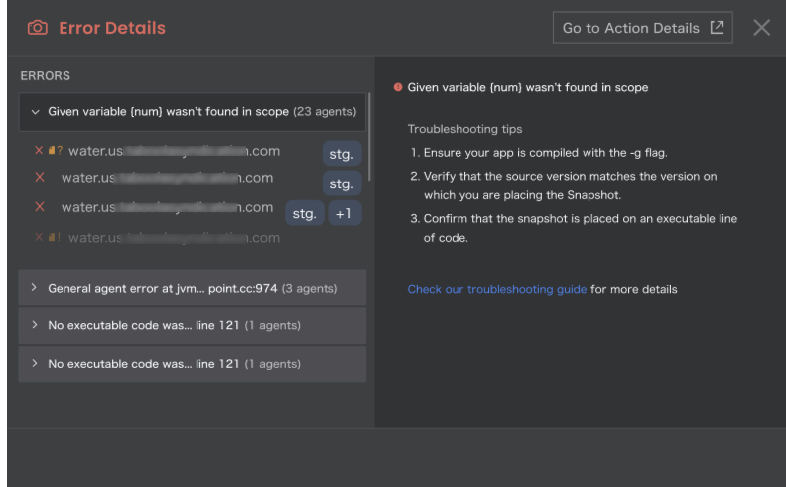
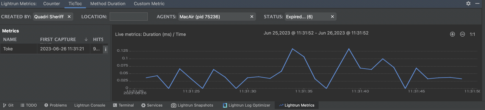
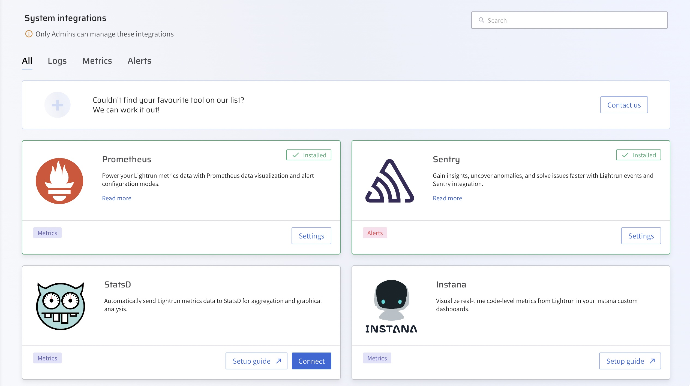
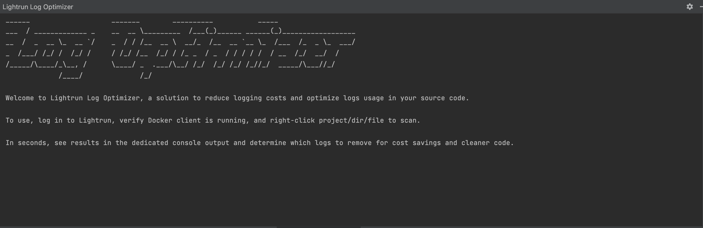
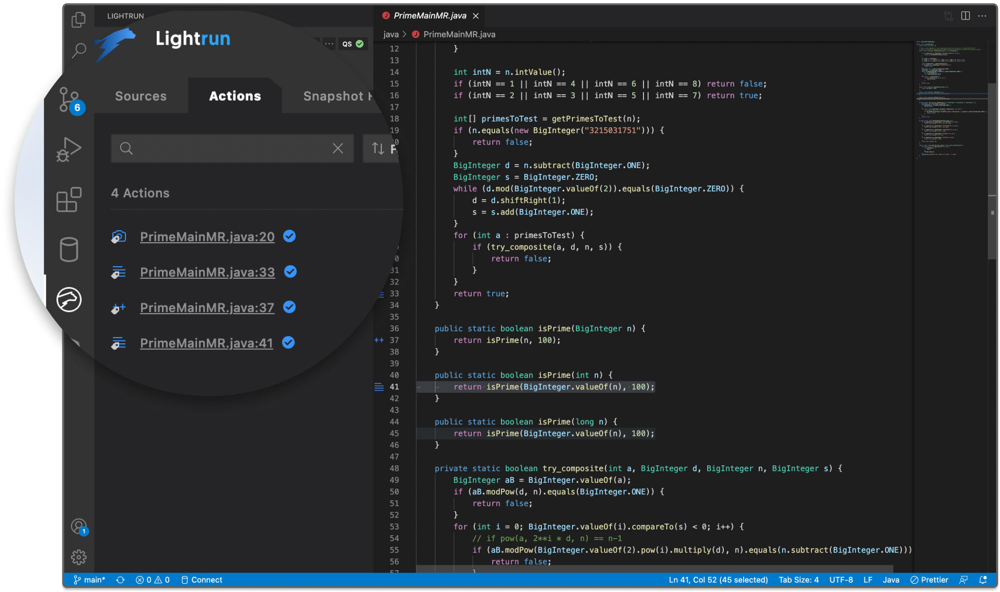
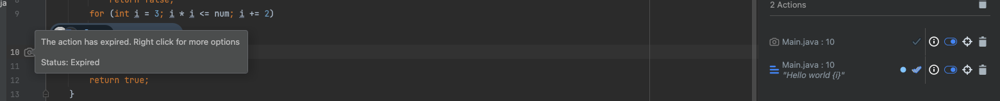
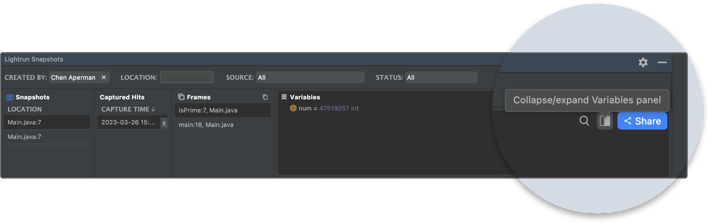
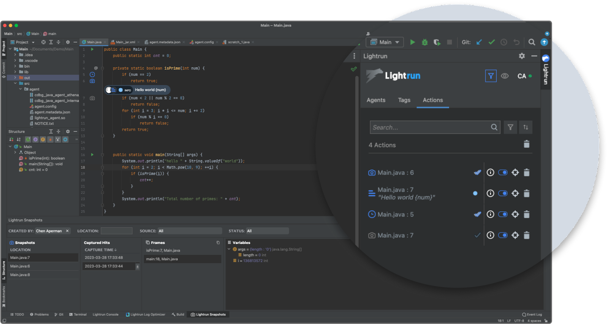

# 2023 Release Notes

Here's where you'll find Lightrun release notes for 2023, including the main highlights, enhancements and fixes made to each version as it is released.

To access the latest release notes, see [Lightrun release notes](/release_notes/lightrun-release-notes/).

## December 2023

### Version 1.22.1

Release Date: December 31, 2023 (On-Premise)

!!! imp "Important"
        
    This On-Premise release incorporates features introduced in the preceding SaaS versions 1.20.x, 1.21.x as well as 1.22.0.

##### <span style="color: #1A3C5A;">Feature Enhancements</span>

**<span style="color: #1A3C5A;">PII Redaction Major Enhancements</span>**

- **<span style="color: #1A3C5A;">Dedicated Library Containing Lightrun Predefined Regex Patterns</span>**
    
    Introducing the dedicated PII (Personal Identifiable Information) Library for streamlined Regex pattern usage. This library was meticulously curated based on industry requirements, offering a comprehensive set of major Regex patterns. This eliminates the need for users to create their own patterns, saving time and effort. The library provides tested patterns, ensuring reliability in PII redaction. Once selected, these patterns are integrated into the user's set of PII rules/templates, enhancing convenience. The Regex patterns are organized according to main categories such as Credit Cards, Financials, General, and Network and will be updated on a regular basis. For more information, see [Set a PII Redaction Pattern using Predefined Patterns](/piiredaction/configure-pii-redaction/#configure-a-pii-redaction-pattern-using-predefined-patterns). 

- **<span style="color: #1A3C5A;">Compliance with RE2 Regular Expression Syntax</span>**

    We've enhanced the accuracy of PII Redaction by aligning patterns with Google’s RE2 Regular Expression syntax. This ensures a standardized approach to redacting sensitive data across all supported runtimes, enhancing the overall reliability of the redaction process. This change ensures that patterns are written once and apply to all supported runtime languages (Java, .NET, Node.js, and Python), but it is highly recommended to validate the functionality of PII Redaction for your desired patterns to ensure proper behavior.

**<span style="color: #1A3C5A;">JetBrains Plugin: Expanded Error Handling for Node.js</span>**

We're excited to introduce an enhancement tailored specifically for our Node.js developers – Expanded Error Handling for Node.js. As part of our ongoing commitment to delivering top-notch tooling for Node.js, this release builds upon the recent advancements made for Java.

The Error Details module in the JetBrains IDE, provides a focused view of errors encountered during Node.js development. Easily access the Error Details module by right-clicking on the action icon in the editor gutter and selecting the Info option. This is particularly useful for identifying errors when placing Lightrun actions on non-executable lines of Node.js code. Included in the Error Details module are Troubleshooting How-Tos, providing targeted solutions for common Node.js development issues, such as source mismatches and file location problems.

##### <span style="color: #1A3C5A;">Bug Fixes</span>

- Fixed multiple internal bugs and security vulnerabilities in the Lightrun server.

---

### Version 1.22.0

Release Date: 20 December 2023 (SaaS)

##### <span style="color: #1A3C5A;">Feature Enhancements</span>

**<span style="color: #1A3C5A;">PII Redaction Major Enhancements</span>**

- **<span style="color: #1A3C5A;">Dedicated Library Containing Lightrun Predefined Regex Patterns</span>**
    
 the dedicated PII (Personal Identifiable Information) Library for streamlined Regex pattern usage. This library was meticulously curated based on industry requirements, offering a comprehensive set of major Regex patterns. This eliminates the need for users to create their own patterns, saving time and effort. The library provides tested patterns, ensuring reliability in PII redaction. Once selected, these patterns are integrated into the user's set of PII rules/templates, enhancing convenience. The Regex patterns are organized according to main categories such as Credit Cards, Financials, General, and Network and will be updated on a regular basis. For more information, see [Set a PII Redaction Pattern using Predefined Patterns](/piiredaction/configure-pii-redaction/#configure-a-pii-redaction-pattern-using-predefined-patterns). 

- **<span style="color: #1A3C5A;">Compliance with RE2 Regular Expression Syntax</span>**

We've enhanced the accuracy of PII Redaction by aligning patterns with Google’s RE2 Regular Expression syntax. This ensures a standardized approach to redacting sensitive data across all supported runtimes, enhancing the overall reliability of the redaction process. This change ensures that patterns are written once and apply to all supported runtime languages (Java, .NET, Node.js, and Python), but it is highly recommended to validate the functionality of PII Redaction for your desired patterns to ensure proper behavior.

**<span style="color: #1A3C5A;">JetBrains Plugin: Expanded Error Handling for Node.js</span>**

We're excited to introduce an enhancement tailored specifically for our Node.js developers – Expanded Error Handling for Node.js. As part of our ongoing commitment to delivering top-notch tooling for Node.js, this release builds upon the recent advancements made for Java.

The Error Details module in the JetBrains IDE, provides a focused view of errors encountered during Node.js development. Easily access the Error Details module by right-clicking on the action icon in the editor gutter and selecting the Info option. This is particularly useful for identifying errors when placing Lightrun actions on non-executable lines of Node.js code. Included in the Error Details module are Troubleshooting How-Tos, providing targeted solutions for common Node.js development issues, such as source mismatches and file location problems.

---

## November 2023

### Version 1.21.0

Release Date: December 3, 2023 (SaaS)

##### <span style="color: #1A3C5A;">Bug Fixes</span>

- Fixed multiple internal bugs and security vulnerabilities in the Lightrun server.

### Version 1.20

Release Date: November 19, 2023 (SaaS)

##### <span style="color: #1A3C5A;">Bug Fixes</span>

- Fixed multiple internal bugs and security vulnerabilities in the Lightrun server.
    
---  

### Version 1.20

Release Date: Novemeber 19, 2023 (SaaS)

##### <span style="color: #1A3C5A;">Bug Fixes</span>

- Fixed multiple internal bugs and security vulnerabilities in the Lightrun server.

 ---

### Version 1.19.2

Release Date: November 19, 2023 (On-Premise)

!!! imp "Important"
        
    This On-Premise release incorporates features introduced in the preceding versions 1.17.x, 1.18.x as well as 1.19.0, 1.19.1, and 1.19.2 (SaaS).

##### <span style="color: #1A3C5A;">Feature Enhancements</span>

**<span style="color: #1A3C5A;">Java Agent: Added Wildcard Support for Class Path Indexing Parameters</span>**
    
The latest update to the Java Agent introduces - Wildcard Support for Class Path Indexing Parameters. This enhancement empowers users to exercise finer control over the indexing of Java classes within Lightrun. With this new capability, you have the ability to specify an absolute path with a range of filenames using wildcard characters that adhere to glob patterns. As a result, determining which Java classes can be excluded from indexing is now an effortless task. For more information, see [Java Agent Configuration](https://docs.lightrun.com/jvm/agent-configuration/#additional-command-line-flags).

**<span style="color: #1A3C5A;">JetBrains Plugin: Error Handling Enhancements</span>**

Customer feedback is invaluable to us, and in this release, we have introduced an intuitive **Error Details** module in the JetBrains IDE. This is helpful in case you encounter an error while placing a Lightrun action, for example, when an action is placed on a non-executable line of code. It is now accessible by right-clicking on the action icon located in the editor gutter and selecting the **Info** option. This information is tagged by an exclamation mark and includes a clear error description, along with actionable guidance on how to resolve the issue. 

Another example of a type of error that is addressed in the **Error Details** module, pertains to source mismatches between a file and agent sources, or when a file cannot be found. 

We have also integrated a set of Troubleshooting How-Tos into the Error Details module. This enhancement empowers you to address issues with precision, guided by specific problem detection.



##### <span style="color: #1A3C5A;">Bug Fixes</span>

- Fixed security vulnerabilities in the Lightrun server.

---

### Version 1.19.1

Release Date: November 8, 2023 (SaaS)

#### <span style="color: #1A3C5A;">Bug Fix</span>

- Fixed an internal bug in the Lightrun server.

---

### Version 1.19.0

Release Date: November 5, 2023 (SaaS)

##### <span style="color: #1A3C5A;">Feature Enhancements</span>

**<span style="color: #1A3C5A;">JetBrains Plugin: Troubleshooting How-Tos Now Available in Your Plugin</span>**

We're excited to introduce Troubleshooting How-Tos integrated into the Error Details module of your JetBrains Plugin. This enhancement empowers you to address issues with precision, guided by specific problem detection.


**<span style="color: #1A3C5A;">JetBrains Plugin: GoTo Code Line Enhancement</span>**

The Lightrun JetBrains plugin's Go-to-code line capabilities have been improved. You can now navigate to an action’s code line from the Lightrun Console, Actions tab, and Snapshot Hits tab; we’ve also added the ability to select a code line if an action returns multiple options. To learn more about the Lightrun JetBrains plugin, see the [JetBrains plugin quick tour guide](https://docs.lightrun.com/getting-around/).

##### <span style="color: #1A3C5A;">Bug Fixes</span>

- Fixed an issue related to SSO login, whereby logging into SSO for the first time with a registered account displayed the registration page.

---

## October 2023

### Version 1.18.1
    
Release Date: October 29, 2023 (SaaS)

##### <span style="color: #1A3C5A;">Feature Enhancement</span>

**<span style="color: #1A3C5A;">Java Agent: Added Wildcard Support for Class Path Indexing Parameters</span>**
    
The latest update to the Java Agent introduces - Wildcard Support for Class Path Indexing Parameters. This enhancement empowers users to exercise finer control over the indexing of Java classes within Lightrun. With this new capability, you have the ability to specify an absolute path with a range of filenames using wildcard characters that adhere to glob patterns. As a result, determining which Java classes can be excluded from indexing is now an effortless task. For more information, see [Java Agent Configuration](https://docs.lightrun.com/jvm/agent-configuration/#additional-command-line-flags).

---

### Version 1.18.0 

Release Date: Oct 22, 2023 (SaaS)

##### <span style="color: #1A3C5A;">Bug Fixes</span>

- Fixed multiple internal bugs in the Lightrun server.

### Version 1.17.0

Release Date: October 8, 2023 (SaaS)

##### <span style="color: #1A3C5A;">Features and Enhancements</span> 

**<span style="color: #1A3C5A;">JetBrains Plugin: Error Handling Enhancements</span>**

Customer feedback is invaluable to us, and in this release, we have introduced an intuitive **Error Details** module in the Jetbrains IDE. This is helpful in case you encounter an error while placing a Lightrun action, for example, when an action is placed on a non-executable line of code. It is now accessible by right-clicking on the action icon located in the editor gutter and selecting the **Info** option. This information is tagged by an exclamation mark and includes a clear error description, along with actionable guidance on how to resolve the issue. 

Another example of a type of error that is addressed in the **Error Details** module, pertains to source mismatches between a file and agent sources, or when a file cannot be found. 

---

### Version 1.16.1

Release Date: October 12, 2023 (On-Premise)

!!! imp "Important"
        
    This On-Premise release incorporates features introduced in the preceding versions 1.15.x and 1.16.0 (SaaS).
    
#### <span style="color: #1A3C5A;">Highlights</span>

**<span style="color: #1A3C5A;">Dedicated PII Redaction Templates Per Agent Pool</span>**

With the introduction of PII Redaction Templates, Lightrun now supports additional granularity for utilizing PII Redaction effectively. You can either establish a single default PII Redaction template to be applied to all your agents or alternatively create and assign distinct PII Redaction templates for different agent pools. 
For example, if you would like to apply PII Redaction only on a Production environment and not on Development or Staging.

To help you get started with configuring your PII redaction on Agent Pools, we provide a single Default template on the PII Redaction page which serves as a starting point for creating your templates. Note that it does not contain any predefined patterns and is not assigned to any agent pools. For more information, see [Assigning PII Redaction templates to Agent Pools](https://docs.lightrun.com/rbac/agent-pool-pii-redaction/).

**<span style="color: #1A3C5A;">VSCode and JetBrains Plugins: Action Creation on Multiple Sources</span>**

We are excited to announce that you can now select multiple agents and tags as a single source when creating an action directly from your IDE. This option lets you simultaneously apply an action to a custom group of agents and tags, which improves your plugin experience and makes it easier to debug with multiple agents and tags. To learn more, see [selecting multiple sources in VSCode](https://docs.lightrun.com/vscode/vscode-multiple-sources) and [selecting multiple sources in JetBrains](https://docs.lightrun.com/multiple-sources/). 

##### <span style="color: #1A3C5A;">Feature Enhancements</span>

**<span style="color: #1A3C5A;">JetBrains Plugin: Copy and Paste Actions Enhancement</span>**

We offer an easy and more efficient way to insert Lightrun actions using 'Copy and Paste' within your JetBrains IDE, which allows developers to easily reuse existing actions in multiple locations within your code. This new functionality applies to all Lightrun action types, including Lightrun [snapshots](https://docs.lightrun.com/snapshots-plugin/), [metrics](https://docs.lightrun.com/metrics/), and [logs](https://docs.lightrun.com/logs/). It simplifies the task of reviving expired actions or duplicating actions which have non-trivial conditions and/or watch expressions.

**<span style="color: #1A3C5A;">JetBrains Plugin: Edit Metrics Mode Enhancement</span>**

You can smoothly edit your existing metrics by simply right-clicking on the metric icon in the editor gutter and selecting the 'Edit' option. This allows you to make adjustments to your metrics actions as needed, ensuring your monitoring and performance tracking remain flexible and adaptable. Note that the edited metric is considered a new action and therefore any data collected prior to editing the action will not be included in the new action. For more information, see [Editing Metrics](https://docs.lightrun.com/metrics/#to-edit-metric-configuration-parameters).

**<span style="color: #1A3C5A;">VSCode Plugin: Duplicate User Actions Enhancement</span>**

Introducing the new `Duplicate` action within your VSCode IDE, which allows developers to easily reuse existing actions in multiple locations within your code. This new functionality applies to all Lightrun action types including Lightrun [snapshots](https://docs.lightrun.com/vscode/vscode-plugin-snapshots/#viewing-and-editing-a-snapshot-configuration), [metrics](https://docs.lightrun.com/vscode/vscode-plugin-metrics/#managing-metrics), and [logs](https://docs.lightrun.com/vscode/vscode-plugin-dynamic-logs/#managing-logs), simplyfying the task of creating non-trivial conditions and/or watch expressions.

**<span style="color: #1A3C5A;">VSCode Plugin: GoTo Code Line Enhancement</span>** 

The Lightrun VSCode plugin's `Go-to-code` line capabilities have been improved. You can now navigate to an action’s code line from the Lightrun Console, Actions tab, and Snapshot Hits tab; we’ve also added the ability to select a code line if an action returns multiple options. To learn more about the Lightrun VSCode plugin, see the [VSCode plugin quick tour guide](https://docs.lightrun.com/vscode/vscode-plugin-quick-tour/).

**<span style="color: #1A3C5A;">JVM Agent: Gain Java Class Indexing Control</span>**

With the introduction of these new parameters, you can now actively control which Java classes will be indexed or not by Lightrun:

- `lightrun_exclude_class_path` : Avoids indexing unnecessary classes that are pointed by the `CLASSPATH` environment       setting.       
This, in turn, helps in reducing unnecessary strain on the CPU and memory when the Java agent is launched.
 - `Index_compressed_archives` : Includes not only Java archives, such as JAR, WAR and EAR files, but also compressed archives in 
ZIP format.
- `lightrun_extra_class_path_delimiter` and `lightrun_exclude_class_path_delimiter`: Sets a non-default delimiters to the list set 
in `lightrun_extra_class_path` and `lightrun_exclude_class_path` (respectively).

For more information, see [Java Agent Configuration](https://docs.lightrun.com/jvm/agent-configuration/#additional-command-line-flags).

**<span style="color: #1A3C5A;">Python and Node.js Agents: Enhanced Large Snapshot Value Capture</span>**

We've taken snapshot capturing to the next level by enabling you to now capture large values for Python and Node.js agents. As part of this enhancement, we've raised the default settings to accommodate larger string values. You can also define maximum limits in the `agent.config` file through the introduction of the `max_snapshot_buffer_size`, `max_variable_size`, and `max_watchlist_variable_size` fields. For more information, refer to the relevant Agent documentation:  [Python Agent Configuration](https://docs.lightrun.com/python/agent-configuration/) and [Node.js Agent Configuration](https://docs.lightrun.com/node/agent-configuration/).

**<span style="color: #1A3C5A;">JetBrains Plugin: Edit Metrics Mode Enhancement</span>**

You can smoothly edit your existing metrics by simply right-clicking on the metric icon in the editor gutter and selecting the 'Edit' option. This allows you to make adjustments to your metrics actions as needed, ensuring your monitoring and performance tracking remain flexible and adaptable. Note that the edited metric is considered a new action and therefore any data collected prior to editing the action will not be included in the new action. For more information, see [Editing Metrics](https://docs.lightrun.com/metrics/#to-edit-metric-configuration-parameters).

 **<span style="color: #1A3C5A;">JVM Agent: JDK 20 Support<span>**

The Lightrun JVM agent now supports JDK 20 excluding features in Preview status.

---

## September 2023

### Version 1.16.0

Release Date: September 26, 2023 (SaaS)

##### <span style="color: #1A3C5A;">Highlights</span>

**<span style="color: #1A3C5A;">VSCode and JetBrains Plugins: Action Creation on Multiple Sources<span>**

We are excited to announce that you can now select multiple agents and tags as a single source when creating an action directly from your IDE. This option lets you simultaneously apply an action to a custom group of agents and tags, which improves your plugin experience and makes it easier to debug with multiple agents and tags. To learn more, see [selecting multiple sources in VSCode](https://docs.lightrun.com/vscode/vscode-multiple-sources) and [selecting multiple sources in JetBrains](https://docs.lightrun.com/multiple-sources/). 

##### <span style="color: #1A3C5A;">Feature Enhancements</span>

**<span style="color: #1A3C5A;">Python and Node.js Agents: Enhanced Large Snapshot Value Capture<span>**

We've taken snapshot capturing to the next level by enabling you to now capture large values for Python and Node.js agents. As part of this enhancement, we've raised the default settings to accommodate larger string values. You can also define maximum limits in the `agent.config` file through the introduction of the `max_snapshot_buffer_size`, `max_variable_size`, and `max_watchlist_variable_size` fields. For more information, refer to the relevant Agent documentation:  [Python Agent Configuration](https://docs.lightrun.com/python/agent-configuration/) and [Node.js Agent Configuration](https://docs.lightrun.com/node/agent-configuration/).

**<span style="color: #1A3C5A;">JVM Agent: JDK 20 Support</span>**

The Lightrun JVM agent now supports JDK 20 excluding features in Preview status.

---

### Version 1.15.0

Release Date: September 10, 2023 (SaaS)

##### <span style="color: #1A3C5A;">Hightlights</span>

**<span style="color: #1A3C5A;">Dedicated PII Redaction Templates Per Agent Pool</span>**

With the introduction of PII Redaction Templates, Lightrun now supports additional granularity for utilizing PII Redaction effectively. You can either establish a single default PII Redaction template to be applied to all your agents or alternatively create and assign distinct PII Redaction templates for different agent pools. 
For example, if you would like to apply PII Redaction only on a Production environment and not on Development or Staging.

To help you get started with configuring your PII redaction on Agent Pools, we provide a single Default template on the PII Redaction page which serves as a starting point for creating your templates. Note that it does not contain any predefined patterns and is not assigned to any agent pools. For more information, see [Assigning PII Redaction templates to Agent Pools](https://docs.lightrun.com/rbac/agent-pool-pii-redaction/).

##### <span style="color: #1A3C5A;">Features and Enhancements</span>

**<span style="color: #1A3C5A;">JetBrains Plugin: Copy and Paste Actions Enhancement</span>**

We offer an easy and more efficient way to insert Lightrun actions using 'Copy and Paste' within your JetBrains IDE, which allows developers to easily reuse existing actions in multiple locations within your code. This new functionality applies to all Lightrun action types, including Lightrun [snapshots](https://docs.lightrun.com/snapshots-plugin/), [metrics](https://docs.lightrun.com/metrics/), and [logs](https://docs.lightrun.com/logs/). It simplifies the task of reviving expired actions or duplicating actions which have non-trivial conditions and/or watch expressions.

**<span style="color: #1A3C5A;">VSCode Plugin: Duplicate User Actions Enhancement</span>**

Introducing the new `Duplicate` action within your VSCode IDE, which allows developers to easily reuse existing actions in multiple locations within your code. This new functionality applies to all Lightrun action types including Lightrun [snapshots](https://docs.lightrun.com/vscode/vscode-plugin-snapshots/#viewing-and-editing-a-snapshot-configuration), [metrics](https://docs.lightrun.com/vscode/vscode-plugin-metrics/#managing-metrics), and [logs](https://docs.lightrun.com/vscode/vscode-plugin-dynamic-logs/#managing-logs), simplyfying the task of creating non-trivial conditions and/or watch expressions.

**<span style="color: #1A3C5A;">VSCode Plugin: GoTo Code Line Enhancement</span>** 

The Lightrun VSCode plugin's `Go-to-code` line capabilities have been improved. You can now navigate to an action’s code line from the Lightrun Console, Actions tab, and Snapshot Hits tab; we’ve also added the ability to select a code line if an action returns multiple options. To learn more about the Lightrun VSCode plugin, see the [VSCode plugin quick tour guide](https://docs.lightrun.com/vscode/vscode-plugin-quick-tour/).

**<span style="color: #1A3C5A;">Java Agent: Gain Java Class Indexing Control</span>**

With the introduction of these new parameters, you can now actively control which Java classes will be indexed or not by Lightrun:

- `lightrun_exclude_class_path` : Avoids indexing unnecessary classes that are pointed by the `CLASSPATH` environment setting.       
This, in turn, helps in reducing unnecessary strain on the CPU and memory when the Java agent is launched.
- `Index_compressed_archives` : Includes not only Java archives, such as JAR, WAR and EAR files, but also compressed archives in 
ZIP format.
- `lightrun_extra_class_path_delimiter` and `lightrun_exclude_class_path_delimiter`: Sets a non-default delimiters to the list set 
in `lightrun_extra_class_path` and `lightrun_exclude_class_path` (respectively).

    For more information, see [Java Agent Configuration](https://docs.lightrun.com/jvm/agent-configuration/#additional-command-line-flags).


##### <span style="color: #1A3C5A;">Bug Fixes</span>

**<span style="color: #1A3C5A;">JetBrains Plugin<span>**

- Fixed an issue where copying stack frames did not copy the class package but rather the object reference. 
- Fixed an issue in multi-project environments, where searching for files did not search all the projects.

**<span style="color: #1A3C5A;">.NET Agent<span>**

- Fixed an issue where cyclic object references were not properly handled.

---

#### Version 1.14.3

Release Date: September 18, 2023 (On Premise)

This On Premise release contains the contents of all the 1.14.x releases.

#### Bug Fixes

- Fixed security vulnerabilities in the Lightrun server.

---

### Version 1.14.2

Release Date: September 4, 2023 (SaaS)

#### Feature Enhancements

#### .Net Agents Support Apple Silicon Macs (M1, M2)

You can now run the .Net Agent on M1 and M2 silicon Macs. This means that you can now create Lightrun actions (dynamic logs, and snapshots) using the .Net Agent.
For more information, see [.Net Agent System Requirements](/dotnet/system-requirements/).
---

## August 2023

#### Version 1.14.1

Release Date: August 28, 2023 (SaaS)

#### Feature Enhancements

#### Extended PII redaction Support within Snapshot Actions

In this release, Lightrun extends its PII redaction support within snapshot actions to consist of additional data structures including arrays, lists, and objects for Variable Names. With PII redaction, customers can easily define within the Lightrun platform which data is being exposed throughout the debugging process and ensure maximum data security and privacy. For more information, see [PII Redaction](/data-security/#pii-redaction). 


#### Bug Fixes

#### General
This release contains internal fixes to service behavior and performance.

---

### Version 1.14.0

Release Date: August 15, 2023 (SaaS)

#### Highlights

#### Lightrun Metrics Visualization for Java

We are happy to announce the release of the JetBrains plugin Lightrun Metrics tool window. With the new Lightrun Metrics tool window, you can view and analyze Lightrun metrics data in its dedicated tool window for up to 24 hours, view your metrics data in the context of captured hits, and analyze Lightrun metrics with new helpful visualization graphs. For more information, see [JetBrains Metrics console](/metrics/#lightrun-metrics-toolwindow). Additionally, you can watch our short demo that focuses on utilizing the new tool to perform [Java performance troubleshooting](https://lightrun.com/lightrun-empowers-developers-with-next-generation-metric-tools-for-java-performance-troubleshooting/).



!!! note 
    To enable this feature, please reach out to Lightrun Support, as it is currently available on demand.
    The Lightrun metrics tool window is currently supported for JetBrains IDE and is available on demand. To try out the metrics tool window, please contact our support team.

#### Features and Enhancments

#### PII Redaction on Agents: Case Insensitivity Supported on Patterns

When setting PII Redaction patterns, the **Make Case Insensitive** field has been added to the Patterns dialog box to support setting case insensitivity for variables. The default is set to case sensitive only. For more information, see [Data Security](/data-security/#to-configure-pii-redaction).

#### JetBrains Plugin: ‘Data Delay’ Status Mode

To enhance your observability experience, we have added the **Data Delay** status mode to the Lightrun plugin's top menu. When in **Data Delay** mode, you can continue debugging and retrieving Lightrun actions but may encounter a short delay of up to 10 seconds for new agents to be added or snapshot action data to be retrieved from the server.

In **Data Delay** mode, you can fetch the logs immediately by clicking **Refresh** on the menu bar or directly in the log console.

#### Server Log Optimization (On-Premise Only) 

To reduce the out-of-the-box log storage, we have changed the default log levels for Lightrun packages to **DEBUG** and 3rd party packages to **WARNING** in the Logs window in the Lightrun Management Portal.
!!! note 
    To make changes to these default settings, please reach out to Lightrun Support, as it is currently available on demand.

#### Bug Fixes

#### General

- Fixed an issue related to PII filters where changing the `Value` to `Variable Name` for an existing pattern would fail.

#### JetBrains Plugin

- Fixed an issue where metrics action data was not being displayed in both the plugin log console and the web console.
- Fixed an issue where snapshot variables with long strings were not retrievable.
- Fixed a Java-related `ConcurrentModificationException` error that was generated when running on Windows.

#### VSCode Plugin

- Fixed an issue specific to the plugin version 1.13 in VSCode, where displaying a captured snapshot caused plugin flickering.

## June 2023

---

### Version 1.13.0

Release Date: June 27, 2023 (SaaS)

#### Features & Changes

#### JetBrains Plugin

- We are happy to announce the release of the JetBrains plugin Lightrun Metrics tool window. With the new Lightrun Metrics tool window, you can view and analyze Lightrun metrics data in its dedicated tool window for up to 24 hours, view your metrics data in the context of captured hits, and analyze Lightrun metrics with new helpful visualization graphs. For more information, see [JetBrains Metrics console](/metrics/#viewing-metrics-output).


- Lightrun now offers a custom plugin repository for organizations who have installed the Lightrun Management Server on-premise and our single-tenant customers. This makes it easier for members of the organization to set up and use the Lightrun plugin. It also helps them keep their plugins updated with new feature releases and improvements from Lightrun. For more information, see [Custom plugin repository](/plugin/#installing-the-lightrun-plugin-from-a-custom-plugin-repository).

!!! note
    The custom plugin repository option is only available to our on-premise and single-tenant customers.

#### General

- The Lightrun integrations page has been given a facelift with a new look and support for more integrations. The integration page has been redesigned and now comprises a wide range of available integrations and their setup instructions. Lightrun users can access all integrations currently enabled for their organization by logging in to the Management Portal and exploring the Integrations page.



- The Lightrun Audit event page has been improved! We have added the ability to filter the captured events list by specifying custom conditions, improved the date filter user interface, and added the ability to export captured events to a CSV file. For more information, see [Audit events](/audit-use/).

#### Lightrun LogOptimizer(™)

- The Lightrun LogOptimizer(™) now supports C-Sharp (C#)! With this update, you can now scan your C# codebase for potential logging issues and get clear instructions on resolving these issues directly from your IDE with the Lightrun LogOptimizer(™). For more information, see [Lightrun LogOptimizer(™)](https://lightrun.com/lightrun-log-optimizer/).

!!! note
    The Lightrun LogOptimizer(™) requires the Docker desktop or engine installed and running on your local machine to scan your code base.

#### Node Agent

- The Lightrun Node agent can now redact personally identifiable information (PII) from logs directly from the agent side. To enable the feature, set `redactionEnabled:true` in your Node agent configuration file. See the [Node Agent configuration](/node/agent-configuration/) for more information.

#### Bug Fixes

#### General

- Fixed security vulnerabilities in the Lightrun server.
- Fixed updated JetBrains plugin UI does not have the option to select agent pools.

#### .NET agent

- Fixed .NET agent snapshots take too much time to evaluate.
- Fixed .NET agent not evaluating base class members for generic base classes.
- Fixed .NET agent failed to evaluate `Guid.ToString()` and `Date.ToString()`.
--- 
## May 2023

### Version 1.12.0

Release Date: May 16, 2023 (SaaS)

#### Features & Changes

#### System for Cross-Domain Identity Management (SCIM)

!!! Update to Release
    As we navigate the pre-GA phase, our team is actively refining and enhancing SCIM for seamless automated user provisioning. <br> Stay tuned for updates on this exciting addition.

We are excited to announce that Lightrun now supports automated user provisioning using the System for Cross-Domain Identity Management (SCIM) protocol. SCIM allows you to automatically manage and communicate user data and permissions between identity providers (IdP) like Okta or Azure AD and a service provider like Lightrun. This feature helps improve your organization’s data security and streamline workflows. For more information, please reach out to our [support team](https://go.lightrun.com/contact-us). 

#### Agent Pool Key rotation 

Lightrun now supports API Key rotation. The API Key rotation feature allows you to change compromised or exposed Agent Pool API keys without losing your Agent Pools or action data. This feature increases your control over your Lightrun agents and secures the servers your agents are running on. For more information, see [Agent Pools](/rbac/manage-pools/).

#### Dynatrace Integration

We have added support for sending metrics data from Lightrun to Dynatrace with the new Lightrun Dynatrace Integration. Dynatrace is an application performance monitoring (APM) and software intelligence solution that gives you visibility and AI-backed answers across your entire digital infrastructure. With the new Lightrun Dynatrace integration, you can import live metrics data from your Lightrun account to your Dynatrace user interface to take advantage of Dynatrace's full-stack monitoring and analytics capabilities. For more information, see [Dynatrace integration](/integrations/dynatrace/).

#### Lightrun LogOptimizer(™)

We have made improvements to the Lightrun LogOptimizer(™) onboarding process. The prerequisites for running the LogOptimizer have been added to the Lightrun LogOptimizer tool window, and error messages have been made clearer to help customers more quickly resolve any issues that may arise while using the LogOptimizer.



#### General

- Lightrun IDE plugins now display a notification when your current plugin version is incompatible with our servers and when a general plugin update is available. This helps you keep up with our new feature releases and improvements. It also makes it easier to take full advantage of Lightrun capabilities.

- Snapshot consoles now filter out hits from deleted snapshots by default.

#### Bug Fixes

#### .NET Agent

- Fixed .NET agent evaluating struct properties as class properties.
- Fixed action file path changes from the full path to filename only, resulting in an Invalid Filename or line number error when editing an action on Windows.
- Fixed auto-properties not evaluated in .Net expressions.
- Fixed .NET agent becomes stuck after multiple refresh attempts.
- Fixed Snapshot base class members' evaluation.

#### Lightrun LogOptimizer(™)

- Fixed duplicate log statement flag emitting multiple results for the same method, one per log line.

#### General

- Fixed security vulnerabilities in the Lightrun server.

#### Node.js Agent

- Fixed typescript path resolving issues.

---

## April 2023

### Version 1.11.3

Release Date: April 4, 2023 (SaaS)

#### Features & Changes

#### JVM Agent

- The Lightrun Java agent now supports **AutoBoxing** and **Auto-unboxing** of Java variables in Java expressions. Previously, when you try to evaluate an expression containing two different data types, i.e., when you add the following expression `myLongVal == 123` into the following code sample,

```java
Long myLongVal = 123;
System.out.println(myLongVal);
```
You will get a `Type mismatch error` since the `myLongVal` variable(wrapper class) does not have the same data type as `123` (long primitive data type). The `myLongVal` must be unboxed to its primitive data type equivalent with an unboxing function before you can use it in the expression.

```java
myLongVal.longValue() == 123
```
With the new autoboxing and unboxing feature, the expression will be evaluated successfully since the unboxing process is done automatically by the Lightrun agent. This addition greatly simplifies writing Java expressions, removes the need for manually boxing and unboxing of variables, and helps developers avoid unnecessary errors. For more information on Java expressions, see [Java expressions](/jvm/java-expressions/). 


#### VSCode Plugin

* We have added an Actions view tab to the VSCode Plugin Lightrun sidebar.



From the new Actions view tab, You can:

- Search for actions with their filename and line number.
- Filter actions with all, expired, and error statuses.
- Delete actions.

For more information, see the [VSCode plugin quick tour](/vscode/vscode-plugin-quick-tour/).

---

## March 2023

### Version 1.11

**Release Date:** March 28, 2023 (SaaS)

#### Features & Changes

#### Lightrun LogOptimizer(™)

- The Lightrun LogOptimizer(™) now supports Windows OS!  The Lightrun LogOptimizer(™) is an automated log optimization solution that scans your current code, or entire codebase, for potential logging issues and returns clear instructions explaining the suspected cases with suggestions on how to fix the logging problem in your IDE.  To learn more about the Lightrun LogOptimizer(™), see [Lightrun LogOptimizer(™)](https://lightrun.com/lightrun-log-optimizer/).

    **Note that the Lightrun LogOptimizer(™) requires the Docker desktop or engine installed and running on your local machine to scan your code base.**

- We have refined the LogOptimizer tool to enable it to work better with Python and Javascript codebases.

#### General

- We have added a new service configuration property called **Expose action output to Lightrun**. Disabling this option will restrict your action output to your application’s standard output(stdout) and prevent your action’s data exposure to Lightrun plugins and installed integrations. This new configuration property helps ensure that Lightrun is not a sub-processor of private data or Personal Identifiable Information (PII), enabling your organization to comply with data privacy laws like GDPR or CCPA. For more information, see [Service configuration](/service-configuration/).

- We have added the Expired status to Lightrun actions. Previously, when an action reached its set time limit, it was assigned the error status. With the new expired status, the number of errors is significantly reduced, and you can now filter expired actions from other actions.



- You can now expand and collapse Snapshots data in the VSCode snapshots tab and the JetBrains Snapshot tool window.

    

#### JetBrains Plugin

* We have added an Actions tab to the JetBrains Plugin Lightrun tool window.



From the new Actions tab, You can:

- Search for actions with their filename and line number.
- Filter actions with all, expired, and error statuses.
- Delete actions.
- View the total action hit count.

For more information, see the [JetBrains plugin quick tour](/getting-around/).

* You can now bulk delete Lightrun actions in the JetBrains plugin.

#### VSCode Plugin

- You can now view Snapshots data created for over 72 hours in the VSCode snapshots tab. This extended length of snapshots provides longer troubleshooting cycles for developers and supports longer audit processes.

#### Management Portal

- Lightrun platform administrators can now re-invite members from their organizations to the Lightrun platform via email.

#### Bug Fixes

#### General

- Fixed Custom Source wrong hit count indication.
- Fixed invokedynamic enabled returning unclear errors. 

#### .NET Agent

- Fixed unsupported metadata tables error.
- Fixed Boolean values showed as Integers in snapshots.
- Fixed null values showed as empty in snapshots.
- Fixed Logpoint has a wrong expression order.
- Fixed .NET agent stops after inserting two actions.
- Fixed invalid file name or line number errors when parsing large PDB files.

---

## February 2023

### Version 1.10.0

Release Date: February 14, 2023 (SaaS)

#### Features & Changes

#### Lightrun LogOptimizer(™)

- We are excited to announce the release of Lightrun LogOptimizer(™). The Lightrun LogOptimizer(™) is an automated log optimization solution that scans your current code, or entire codebase, for potential logging issues and returns a message explaining the suspected cases with suggestions on how to fix the logging problem directly from within your IDE. The Lightrun LogOptimizer(™) aims to help reduce noise generated by overlogging and the overall costs of logging. For more information, see [Lightrun LogOptimizer(TM)](/logoptimizer/overview/).

#### .NET Agent

- The Lightrun .NET agent is now available in Early Access. With the Lightrun .NET agent, you can add Logs and Snapshots to your .NET applications, including frameworks like .NET Core and .NET Framework, at runtime without the need for hot restarts or redeployments. Lightrun users interested in trying out the new Lightrun .NET agent should contact [our support team](https://go.lightrun.com/contact-us) for more information.

#### Role-Based Access Control

- The extended Lightrun Role-Based Access Control (RBAC) feature is now available in Early Access. The extended RBAC feature allows Lightrun customers to restrict access or grant permissions to users within their organization with Groups, Agent Pools, and Roles. Lightrun users interested in trying out the RBAC feature should contact [our support team](https://go.lightrun.com/contact-us) for more information.

#### General

- We have added the ability to share snapshot hits data with a URL link. The URL link can be copied or exported into a Slack or Jira message format to be shared on Slack or Jira from any of our IDE plugins and the Management Portal. For more information, see [Snapshots](/actions/snapshots/).

- You can now select specific integrations like Prometheus as your action output target when creating Lightrun actions from your IDE plugin. This option makes it easier to configure where you want to view your action output in addition to the Lightrun Console. For more information, see [Action Output Target](/actions/output-routing/).

#### VSCode Plugin

- We have made some improvements to the VSCode Snapshots tab:
* Lightrun users can now view snapshot hits created by other users in their organization. This change will make it easier to get debugging inputs from colleagues and facilitate cross-team collaboration.
* Snapshot hits data now load lazily from the Lightrun server. This process will help to reduce snapshot hits data load time considerably, offer greater troubleshooting visibility through a larger variable tree depth, and reduce memory usage by the Lightrun VSCode plugin.
* We have added the ability to search a snapshot stack trace and variables.

#### JetBrains Plugin

- We have made enhancements to the JetBrains Log console. We have added the Filename and Line to the log output format, which users can click to navigate to the relevant action using the **goto** action. This change will help to improve the overall troubleshooting experience in your JetBrains IDE.

#### Lightrun CLI

- You can now configure the Lightrun CLI to return data in a JSON format. To do that, add the `j` or `json` flag to the CLI command. For more information, see [Lightrun CLI](/cli/cli_reference/). 

#### JVM Agent

- The Lightrun JVM agent now supports JDK 18 and JDK 19. 

#### Bug Fixes

-  Fixed Lightrun java agent returns an error when file has a common name with other files.

---

## January 2023

### Version 1.9.0

Release Date: January 2, 2023 (SaaS)

#### Features & Changes

#### General

- We have extended our PII redaction capabilities to support redacting data from Lightrun based on the Variable name. In previous versions, you could only redact data from Lightrun by providing the regex value for the data. With this release, you can prevent Lightrun from evaluating snapshots and logging sensitive data by providing the Variable's name. For more information, see [PII redaction](/data-security/#pii-redaction).

- Snapshot data sent from the Lightrun server to IDE plugins are now compressed in the server and undergo lazy decompression in the plugin before being presented to a user. This process helps to decrease snapshot hits loading time, display larger variable tree depth, eliminate the `max depth` error, lower memory consumption, and improve performance. 

#### JVM Agent

- We have added support for running our Java agent on Linux and Alpine operating systems using the ARM processor.

#### VSCode Plugin

- The performance of the VSCode plugin Lightrun Snapshots tab has been improved. Snapshot hits load faster, and we have made it easier to navigate between hits in the improved tab.

#### JetBrains Plugin

- We have implemented a filter only my actions feature in the JetBrains plugin that allows you to display only actions created by you.

- Clicking on the “Snapshot taken!” notification now opens the JetBrains Snapshot Console with the relevant hit.

- You can now view a list of your recently used conditions in the JetBrains plugin.

#### Bug Fixes

- Fixed copying variables from snapshot in VSCode plugin does not include inner objects.
- Fixed refactored NPE shown after tagged snapshots are deleted.

