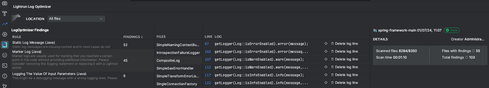

# Lightrun Release Notes

Here's where you'll find the latest Lightrun release notes, including the main highlights, enhancements, and fixes made to each version as it is released.

- For release notes of previous releases, see:

  - [2023 releases](/release_notes/2023-releases/) 

  - [2021 - 2022 releases](/release_notes/2022-releases/)

- For a consolidated list of all feature and parameter changes and deprecations, see [Functionality changes and deprecations](/release_notes/functionality-changes-deprecations/). Note that all changes are also documented by release in this document.

    Before upgrading to a new version of Lightrun, we recommend reviewing this list of changes as it may include breaking changes that require your attention. 

- For a list of known issues, refer to [Known Issues](/release_notes/known-issues/).

## August 2024

### Version 1.38 (Latest)

Release date: 4 August, 2024  (SaaS, On-Premise to follow the next week)

    HEADS UP ANNOUNCEMENT  
    
    <b>Changes to SCIM User Management</b>

     In the upcoming release, SCIM admins will be able to assign the Lightrun Admin role directly within Lightrun, rather than through SCIM, as was done previously. Additionally, we have introduced improvements to the way you assign Lightrun groups and roles to your SCIM users within the Lightrun Management Portal. If you have set up your Lightrun Admin role directly using SCIM, please reach out to your Lightrun representative to learn more about the new changes and how to prevent any potential disruptions.

##### Feature Enhancements

**JetBrains and VS Code Plugins: Deployment Switcher** 

!!! Note
    
    You need a Lightrun Enterprise plan to use the Deployment Switcher functionality. For more information, see [Pricing](https://lightrun.com/pricing/).

    The Deployment Switcher feature applies only to Single-tenant and On-premise environments and is activated upon demand. To enable this feature, please [reach out](mailto:lightrun-ticket@lightrun.com).

In a multi-deployment environment, you no longer need to log out of the IDE to move from one deployment to another. Starting from this release, Lightrun introduces a Deployment Switcher directly within the Lightrun plugin in your IDE. This feature is designed for developers in large enterprise organizations who use Lightrun to debug applications across multiple deployment instances. You can now seamlessly switch between deployments, such as from `TESTING` to `PRODUCTION` deployment or between `TESTING-EU and TESTING-US`.

For more information, see:

- [Switch between deployments in the Lightrun plugin in JetBrains](/jetbrains/plugin-deployment-switcher/).
- [Switch between deployments in the Lightrun plugin in VS Code](/vscode/deployment-switcher/).

**Node.JS agent: Enhanced Performance for Large and Nested Snapshots** 

In version 1.38, Node.js developers can enjoy an improved experience when capturing nested and large snapshots, thanks to the introduction of new parameters:

- `maxVariableDepth`: Limits the number of nested properties to reduce the overall capture time. Gathered for deeply nested objects. For example a->b->c with a value of 2, will only capture values of a and b.

- `maxWatchProperties`: Limits the number of properties gathered on large objects to reduce the overall capture time. This also applies to objects that are a collection. For example, setting `const a = [1,2,3]` with `maxProperties: 1` and `maxWatchProperties`: `2`, will return `1`, `2`  when using a watch expression for a. Note that this is an extended limitation for Watch expressions. 

In addition, we have updated the default values for the following existing parameters that may lead to breaking changes. 

- `maxExpandFrames`:  The default value has been changed from `5` to `4`.
- `maxProperties`: The default value has been changed from `10` to `20`.

For more information, see [Node Agent Configurations](/node/agent-configuration/#capture).

**Java Agent: New snapshot-related parameters** 

To enhance the peformance when working with snapshots, we have added the following new parameters:

- `capture_object_explore_max_depth`: Sets the maximum depth of nested objects. The default value is `50`.
- `snapshot_object_max_members`: Controls the number of properties captured in an object. The default value is `100`.
- `snapshot_expression_max_collection_size`: Controls the number of items captured for a collection in a watch expression. The default value is `1024`.

For more information, see [Java Agent Configurations](/jvm/agent-configuration/).

##### Bug Fixes

- Fixed multiple internal bugs and security vulnerabilities in the Lightrun server.

## July 2024

### Version 1.37.2

Release date: 23 July, 2024  (SaaS, On-Premise to follow the next week)

##### Bug Fixes

- Fixed an internal issue related to placing snapshots in Lambda expressions in the .NET agent.

-----

### Version 1.37.1 

Release date: 22 July, 2024  (SaaS, On-Premise to follow the next week)

!!! Important

    Please refrain from using this version for VS Code due to a plugin issue.

##### Bug Fixes

- Fixed an issue related to the Custom Dynamic Logger in the .NET agent.

---

### Version 1.37.0

Release date: 15 July, 2024  (SaaS, On-Premise to follow the next week)

##### Highlights

**New SIEM Integration with Lightrun Audit Events** 

Lightrun's SIEM integration enables real-time streaming of audit events to customer SIEM systems, such as Splunk. This connection allows notifications for various events, including action-related runtime events, auditable operations, user management, and configuration changes.

Security information and event management (SIEM) is a methodology for detecting, analyzing, and responding to security threats to protect business operations. It integrates security information management (SIM) and security event management (SEM) into a unified system. For more information, see [SIEM Integration](/integrations/siem).

**.NET Agent: Introducing the New .NET Sandbox**

The Lightrun .NET Sandbox is a central component in the Lightrun .NET agent. It verifies and validates full integrity of your application’s behavior when running with Lightrun actions. The Lightrun Sandbox verifies and validates full integrity of your application’s behavior when running with Lightrun actions. The Lightrun Sandbox guarantees no exceptions, system I/O, system calls, or state/flow changes, and ensures that only read-only code is ever added to your application. For more information, see [Lightrun Architecture](https://docs.lightrun.com/architecture/).

##### Bug Fixes

- Fixed multiple internal bugs and security vulnerabilities in the Lightrun server.

---

### Version 1.36.4

Release date: 14 July, 2024  (SaaS, On-Premise to follow the next week)

##### Bug Fixes

- Fixed an internal issue related to the Lightrun server.

---

### Version 1.36.3

Release date: 10 July, 2024  (SaaS, On-Premise to follow the next week)

##### Bug Fixes

- Fixed an issue related to the .NET agent regarding `DebugType` portable support for IIS.

---
### Version 1.36.2

Release date: 7 July, 2024  (SaaS, On-Premise to follow the next week)

##### Bug Fixes

- Fixed an internal issue related to the JetBrains plugin.

---

### Version 1.36.1

Release date: 3 July, 2024  (SaaS, On-Premise to follow the next week)

##### Bug Fixes

- Fixed internal issues related to the .NET agent. 
- Fixed an internal issue related to the JetBrains plugin.

### Version 1.36.0

Release date: 1 July, 2024  (SaaS, On-Premise to follow the next week)

##### Feature Enhancements

**Gain Insight into your Agent Consumption in the New Usage Dashboard**

Introducing the first phase of the Usage Dashboard,  now available to selected customers, as part of the Lightrun Management Portal, with a focus in this release on Agent usage. If you are interested in viewing your data in the dashboard, please contact us directly.

Key Features:

- Real-Time Agent Monitoring: View the current number of active agents in your organization.
- Trend Analysis: Access a trend graph that displays the number of active agents over a specified period.
- Advanced Filtering: Utilize a set of advanced filters to customize the date range to suit your specific needs.

For more details, see [Usage Dashboard](/usage-dashboard/).

**Python Agent: Introduced New Snapshot-related Parameters in agent.config**

In this release, we have added a new set of snapshot-related parameters to the `agent.config` file. These new parameters include:

- `max_collection_size`: Controls the number of items captured for a collection.
- `max_watchlist_collection_size`: Controls the number of items captured for a collection in a watch expression.
- `max_frames_with_vars`: Controls the number of top stack frames for which to read values of local variables.
- `max_object_members`: Controls the number of properties captured in an object.

For more information, see [Python Configuration Parameters](/python/agent-configuration/#configuration-parameters)

**VS Code Plugin: Enhanced Action-related Capabilities**

You can now simply right-click on a line in your code to quickly add a Lightrun action. This new feature enhances your workflow by allowing more efficient debugging and monitoring directly from the editor.

**Node.js Agent: Node.js 22 Support**

The Lightrun Node.js agent now officially supports Node.js v.22.

**JetBrains IDE Plugins: JetBrains Minimum Version is 2022.3**

To ensure optimal performance and compatibility, we are updating the minimum supported JetBrains version to 2022.3.

Effective Immediately: Users must update to JetBrains version 2022.3 or later to continue receiving updates and support for the plugin.

Why This Change? This update is part of our ongoing efforts to enhance compatibility and provide better service to our customers.

For any questions or assistance with updating, please contact our support team.

##### Bug Fixes

- Fixed multiple internal bugs and security vulnerabilities in the Lightrun server.

---
## June 2024

### Version 1.35.4

Release date: 23 June, 2024 (SaaS, On-Premise)

##### Bug Fixes

- Fixed an internal issue related to the Lightrun server.

---

### Version 1.35.2

Release date: 19 June, 2024 (SaaS, On-Premise to follow the next week)

##### Bug Fixes

- Fixed an issue related to the .NET Agent.
- Fixed an issue related to the JetBrains plugin for Java.

---

### Version 1.35.0

Release date: 17 June, 2024 (SaaS, On-Premise to follow the next week)

###### Feature Enhancements

**Java Agent: Java 22 Support**

The Lightrun Java plugin now supports Java 22.

**Lightrun Server: Extended ARM64 Support**

Lightrun Server has extended support for on-premise deployments on ARM64, in addition to x86-64 for our existing platforms, plus Mac, which is ARM64 only.

##### Bug Fixes

- Fixed multiple internal bugs and security vulnerabilities in the Lightrun server.

---

### Version 1.34.5

Release date: 10 July, 2024  (SaaS, On-Premise to follow the next week)

##### Bug Fixes

- Fixed an issue related to the .NET agent regarding `DebugType` portable support for IIS.

----

### Version 1.34.4 

Release date: 20 June, 2024 (SaaS, On-Premise to follow the next week)

##### Bug Fixes

- Fixed an issue related the Lightrun server.

---

### Version 1.34.3

Release date: 14 July, 2024 (SaaS, On-Premise to follow the next week)

##### Bug Fixes

- Fixed an internal issue related to the metrics flow in the Lightrun server.

---

### Version 1.34.2

Release date: 5 June, 2024 (SaaS, On-Premise to follow the next week)

##### Bug Fixes

- Fixed an internal issue related to the Lightrun server.

---

### Version 1.34.1

Release date: 4 June, 2024 (SaaS, On-Premise to follow the next week)

##### Bug Fixes

- Fixed an issue related to installing the Lightrun plugin in JetBrains.

---

### Version 1.34.0

Release date: 2 June, 2024 (SaaS, On-Premise to follow the next week)

###### Feature Enhancements

**All Lightrun Agents: Extended Enhanced Log File Standardization**

!!! important
    Breaking Change: If you are sending the Lightrun agent log to a log management solution, please notice that the log file name has changed and may require changes from your side.

In this release, we have standardized the log file naming conventions across all supported development languages. This update provides administrators with better control through consistent log naming, making it easier to identify and manage logs. In addition, we have aligned the following log-related parameters for all the agents:

- `agent_log_target_dir`
- `agent_log_level`
- `agent_log_max_file_size_mb`
- `agent_log_max_file_count`
  
For more information, refer to [Java](/jvm/agent-configuration/), [Python](/python/agent-configuration/), [Node.js](/node/agent-configuration/#agent-log) and [.NET](/dotnet/agent-configuration/) documentation.

##### Bug Fixes

- Fixed a number of security vulnerabilities in the Lightrun server.

## May 2024

### Version 1.33.2

Release date: 26 May, 2024 (SaaS, On-Premise)

##### Bug Fixes

- Fixed a security vulnerability in the Lightrun server.
  
---

### Version 1.33.1

Release date: 21 May, 2024 (On-Premise)

##### Bug Fixes

- Fixed a security vulnerability in the Lightrun server.
  
---  

### Version 1.33.0

Release date: 20 May, 2024 (SaaS, On-Premise to follow the next week)

    HEADS UP NOTICE: Introducing Enhanced Login Method to the Lightrun Server

    To align with industry standards and to streamline and simplify the user login process 
    for the Lightrun Server, we have implemented a single login method. This strategy 
    eliminates the cumbersome task of managing multiple methods in parallel by allowing 
    administrators to set a single login method from three options: user-defined password, 
    SSO, or Google.   

    From version 1.33, this new feature will be rolled out gradually and will 
    only affect a number of selected customers.   

    So what's changed?

    When you apply the new login method, you will need to select your preferred login method. 
    Until you do that, your existing users will be unaffected and will be able to continue 
    working, as usual. However, the administrator will not be able to add new users until you select your 
    preferred login method.         

    Once the administrator selects the preferred login method, users will receive 
    an activation email. Users' history will remain unaffected, and as soon as 
    users reactivate, they will be able to pick up right where they left off.     

    Stay tuned for further instructions as we roll out these changes.
                                                                                           
###### Feature Enhancements

**.NET Agent: Concurrent Support for Additional Profiling Tools**

Lightrun introduces support for profiler chaining in the .NET agent allowing you to run multiple profiling tools simultaneously on the same application or system. This feature allows developers and operators to gather performance data and insights from different profiling tools concurrently without conflicts or interference.

In practical terms, profiler chaining enables the coexistence of an additional profiling agent or tool in parallel to Lightrun’s .NET agent. For example, Lightrun's .NET agent and other Application Performance Monitoring (APM) tools, such as Datadog on the same .NET application or environment. Each profiling tool can collect specific types of performance data or provide unique insights into the application's behavior. For more information, see [Profile chaining for the Lightrun .NET Lightrun agent](https://docs.lightrun.com/dotnet/profile-chaining/). 

**Java Agent: Enhanced Log File Naming Format** 

!!! important
    Breaking Change: If you are sending the Lightrun agent log to a log management solution, please notice that the log file name has changed and may require changes from your side.

In our ongoing commitment to providing administrators with enhanced control over their agents, we have standardized the log naming convention. This enhancement aims to make the convention more intuitive, facilitating easier identification and detection of your logs.

The new format is: `lightrun_java_agent.<PID>.<TIMESTAMP>.<LOG_ROTATION_RUNNING_INDEX>.log`

An example of the new log format: `lightrun_java_agent.22840.20240513-153557.1.log` 
In the example, The new convention includes the log name - `lightrun_java_agent`, the log file PID - `22840`, the date and time following the `YYYYMMDD-HHMMSS` convention - `20240513-153557`, and the log rotation running index is `1`.

To facilitate the transition, here is the log convention in previous versions:

| Version           | Log Format                                                                                       |
|-------------------|--------------------------------------------------------------------------------------------------|
| Version 1.32     | `lightrun.log.<LOG_ROTATION_RUNNING_INDEX>.<TIMESTAMP>.`                                           |
| Prior to version 1.32 | `lightrun_java_agent.<HOSTNAME>.<USER>.log.<TIMESTAMP>.`                                       |

In forthcoming releases, this initiative will be extended to Node.js and .NET log files.

##### Bug Fixes

- Fixed multiple internal bugs and security vulnerabilities in the Lightrun server.

---
  
### Version 1.32.5

Release date: 22 May, 2024 (On-Premise)

##### Bug Fixes

- Fixed a security vulnerability in the Lightrun server.
  
---

### Version 1.32.4

Release date: 20 May, 2024 (On-Premise)

##### Bug Fix<es/span>

- Fixed an issue related to Single Sign-on (SSO).

---

### Version 1.32.3

Release date: 15 May, 2024 (On-Premise)

##### Bug Fixes

- Fixed a security vulnerability in the Lightrun server.
  
---

### Version 1.32.1

Release date: 9 May, 2024 (SaaS, On-Premise to follow the next week)

##### Bug Fixes

- Fixed a security vulnerability in the Lightrun server.

---

### Version 1.32.0

Release date: 6 May, 2024 (SaaS, On-Premise to follow the next week)

###### Feature Enhancements

**Java Agent: New Parameters for Customizing Agent-related Logs**

In this release, we introduced new parameters aimed at optimizing your Agents' log settings. Now, you have even greater control over how your Agents handle logs. You can fine-tune these settings using the following four configurable parameters, accessible via both the agent.config file, environment variables and the command line flags: `agent_log_max_file_size_mb`, `agent_log_max_file_count`, `agent_log_target_dir`, and `agent_log_level`. For more information, see [Java Agent Configuration](/jvm/agent-configuration/).

##### Bug Fixes

- Fixed multiple internal bugs and security vulnerabilities in the Lightrun server.

## April 2024

### Version 1.31.1

Release date: 22 April, 2024 (SaaS, On-Premise to follow the next week)

##### Bug Fixes

- Fixed an issue related to SCIM in the Lightrun server.

----

### Version 1.31.0 

Release date: 21 April, 2024 (SaaS, On-Premise to follow the next week)

###### Feature Enhancements

**NET Agent: Added Blocklisting Support**

We have expanded blocklisting support to the .NET agents. Blocklists can be used to prevent Lightrun actions from being inserted in classes that might expose sensitive data. Files and packages that include the patterns you've specified in the Blocklist table are protected and your team won't be able to add actions into those code areas. For more information, see [Blocklists](/blocklists/).

##### Bug Fixes

- Fixed an issue related to SCIM in the Lightrun server.
  
---

### Version 1.30.2

Release date: 11 April 2024

##### Feature Enhancement

**.NET Agent: Support Apple Silicon Macs (M1, M2)**

You can now run the .Net Agent on M1 and M2 Apple silicon. This means that you can now create Lightrun actions (dynamic logs, and snapshots) using the .Net Agent. For more information, see [.Net Agent System Requirements](/dotnet/system-requirements/).

##### Bug Fixes

- Fixed multiple internal bugs and security vulnerabilities in the Lightrun server.

---

## March 2024

### Version 1.29.1

Release date: 24 March, 2024 (SaaS, On-Premise to follow the next week)

##### Bug Fixes

- Fixed a security vulnerability in the Lightrun server.

---

### Version 1.29.0
Release date: 24 March, 2024 (SaaS, On-Premise to follow the next week)

##### Feature Enhancements

**Added Blocklisting Support**

We have expanded blocklisting support to the .NET agents. Blocklists can be used to prevent Lightrun actions from being inserted in classes that might expose sensitive data. Files and packages that include the patterns you've specified in the Blocklist table are protected and your team won't be able to add actions into those code areas. For more information, see [Blocklists](/blocklists/).

##### Bug Fixes

- Fixed multiple internal bugs and security vulnerabilities in the Lightrun server.

---

### Version 1.28.1

Release Date: 17 March, 2024 (On-Premise)

##### Bug Fixes

- Fixed security vulnerabilities in the Lightrun server.

---

### Version 1.28.0

Release Date: 10 March, 2024 (SaaS, On-Premise to follow the next week)

###### Feature Enhancements

**Lightrun Management Portal Enhancements: Introducing the New Identity and Access Management Tab**

As part of our ongoing commitment to improving your experience with our Management Portal webUI, we've revamped the **Settings** section to offer a smoother user experience. Introducing the new **Identity and Access Management** tab, which now includes [Users](/useradmin-roles/), [Agent Pools](/rbac/manage-pools/), [Permissions & Access](/rbac/manage-groups/) and the new Identity Configuration page. Additionally, to simplify login management, we've centralized [SSO](/sso/), [SCIM](/scim/), and **Self Service** settings under the revamped Identity Configuration page. Please note that the **Self Service** feature enables you to invite users using a preset URL to join your organization from the New Member page. It is important to mention that 'Self Service' is enabled by default.

##### Bug Fixes

- Fixed multiple internal bugs and security vulnerabilities in the Lightrun server.

---

### Version 1.27.0

Release Date: 25 February, 2024 (SaaS, On-Premise to follow the next week)

##### Feature Enhancements

**Python Agent: Python 3.11.0 Support**

The Python Agent now supports Python 3.11.0. 
Refer to [Known Limitations](/release_notes/known-issues/) for details.

##### Bug Fixes

- Fixed multiple internal bugs and security vulnerabilities in the Lightrun server.

---

## February 2024

### Version 1.26.0
Release Date: 18 February, 2024 (SaaS, On-Premise to follow the next week)

##### Feature Enhancements

**Java, Python, and, Node.JS Agents: PII Redaction Enhancements**

- **PII Redaction Now Processes Complex and Nested Objects**
  
    In this release, we have extended the support for PII redaction to nested objects to ensure comprehensive privacy protection within complex data structures, bolstering compliance efforts and minimizing the risk of data breaches. With this update, we've tackled the challenge of masking values within multi-level objects during PII Redaction by Name.

    Please note that when PII redaction is performed on Node.JS and Python languages, the nested objects will be redacted and displayed in the log lines as REDACTED. The behavior of the Lightrun Java agent differs, as it consistently masks nested objects higher than level 1 hierarchy with <Object>, irrespective of whether PII redaction is enabled or not.

- **Enhanced Rendering of Java Maps and Arrays**

  From version 1.26, Lightrun has also improved the rendering of map and arrays object types.

!!! Note
    Due to the latest changes to the PII Redaction feature, it is recommended that you review your current PII rules and adhere to the changes to have a much simpler and streamlined functionality. Feel free to contact your customer support team for any questions or issues that you might have.

##### Bug Fixes

- Fixed multiple internal bugs and security vulnerabilities in the Lightrun server.

---

### Version 1.25.0

Release Date: 29 January, 2024 (SaaS, On-Premise to follow the next week)

!!! note
    This release applies to SaaS and On-Premise. The On-Premise release incorporates all the content introduced in the preceding SaaS versions 1.23.x, as well as 1.24.0. Additionally, both releases incorporate the bug fixes and security fixes introduced in this release.

##### Feature Enhancements

**LogOptimizer Major Enhancements**

  On-Premise: Introduced in this version | SaaS: From version 1.24

We have taken the Lightrun LogOptimizer solution to the next level by introducing the following enhancements:

- A shiny and intuitive new UI.
- Aggregated filtered results.
- Ability to filter results by path.
- Go to the suspected logging statement directly from the scan results.
- Ability to delete a log directly from the LogOptimizer.
For more information, see [LogOptimizer Overview](/logoptimizer/overview/).

**Private System API Keys Support**

On-Premise: Introduced in this version | SaaS: From version 1.24

We have introduced private system API Keys with AES-128 encryption. This significant enhancement adds an extra layer of security to the application's communication. With this feature, users can now generate API keys through the Lightrun Management Server, creating a secure authentication mechanism for various application requests. This includes requests to SCIM endpoints and Lightrun Integrations, such as Prometheus integration endpoints. For more information, see [Lightrun System API Keys](/api-keys/).

**JVM Agent: JDK 21 Support**

On-Premise: Introduced in this version | SaaS: From version 1.24

The Lightrun JVM agent now supports JDK 21.

##### Bug Fixes

- Fixed an issue related to the performance of the Lightrun LogOptimizer tool. 
- Fixed multiple internal bugs and security vulnerabilities in the Lightrun server.

---

## January 2024

###  Version 1.24.0

Release Date: 14 January, 2024 (SaaS)

##### Feature Enhancements

**JVM Agent: JDK 21 Support**

The Lightrun JVM agent now supports JDK 21. 

##### Bug Fixes

- Fixed an issue in the Lightrun JetBrains plugin where creating a new action from the gutter, resulted in an incorrect line number entry. 

---

### Version 1.23.1

**Release Date**: 2 January, 2024 (SaaS)

##### Feature Enhancements

**LogOptimizer Major Enhancements**

We have taken the Lightrun LogOptimizer solution to the next level by introducing the following enhancements:

- A shiny and intuitive new UI.
- Aggregated filtered results.
- Ability to filter results by path.
- Go to suspected logging statement directly from the scan results.
- Ability to delete a log directly from the LogOptimizer.

To learn more, see [LogOptimizer Overview](/logoptimizer/overview/).

##### Bug Fixes

- Fixed multiple internal bugs and security vulnerabilities in the Lightrun server.

---

### Version 1.22.4

Release Date: January 21, 2024 (On-Premise)

##### Bug Fixes

- Fixed a security vulnerability in the Lightrun server.

---

### Version 1.22.3

Release Date: January 16, 2024 (On-Premise)

##### Feature Enhancements

**JVM Agent: JDK 21 Support**

The Lightrun JVM agent now supports JDK 21. 

##### Bug Fixes

- Fixed a security vulnerability in the Lightrun server.

---

### Version 1.22.2

Release Date: January 2, 2024 (On-Premise)

##### Bug Fixes

- Fixed an internal bug in the Lightrun server.