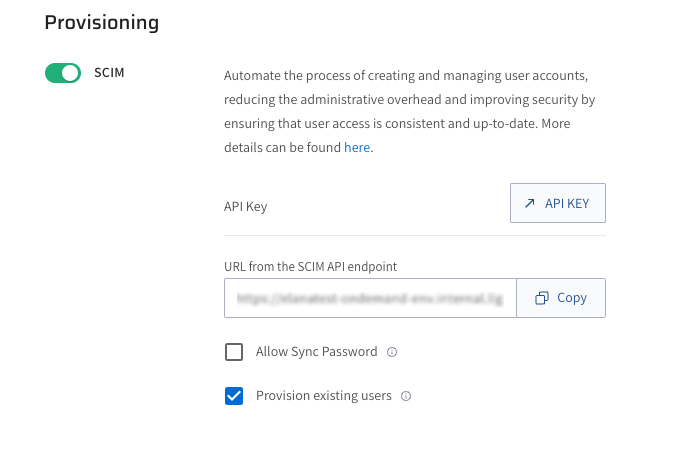

# SCIM provisioning using Azure AD

Lightrun supports using the open standard System for Cross-domain Identity Management (SCIM) to:

- Grant your users in your company seamless access to the Lightrun Application using their Azure credentials.
- Add, remove, and assign your users in your organization to Lightrun basic or manager roles.

For more information, see [SCIM provisioning overview](scim.md).

## Prerequisites

To implement the Lightrun SCIM protocol, you need to be aligned with the following prerequisites.

- Lightrun supports Cross-domain Identity Management (SCIM 2.0).
- The Lightrun SCIM feature is only available to users on our Enterprise plan; please contact our Support team for more information.
- Enable SSO in the **Identity Configuration** page located under the **Identity and Access Management** tab. For more information, see [SSO](sso.md).
- Generate a dedicated API Key for your integration with SCIM. For more information, see [Lightrun System API Keys](api-keys.md).

## Set up SCIM in Lightrun

1. Log in to your Lightrun account.
2. Navigate to the **Identity and Access Management** section > **Identity Configuration** > **Provisioning** section > **SCIM**.

   

3. To enable SCIM, click the **SCIM** toggle.
4. In the SCIM page, copy and save the following URLs:
   - In the **API Key** field, click **API KEY** to be routed to the **API key** page. You will need to generate an API Key and copy it to Azure’s SCIM settings. The API Key is used for authentication and authorization between the SCIM server with and the connected Lightrun Management portal.
   - In the **URL from the SCIM API endpoint** field, click **Copy** and save the URL.

5. (Optional) Click **Allow Sync Password** to match the user’s Active Directory (AD) password and their Azure password. 

Proceed to configure Azure AD as your identity provider.

## Configure SCIM in AZURE AD 

1. Sign in to the Azure Portal, and click **Enterprise applications** in the sidebar.

   

2. Click **+New Application** in the top bar.

  

3. Click **Create your own application**.

4. Provide a name for your `<App-Lightrun>` and click **integrate any other application you don’t find in the gallery**, and click **Create**.

   

    The newly created Lightrun App dialog opens.

4. Click **Provisioning**.

   

5. In the **new** dialog, click **Get started**.

   The Provisioning page opens.

    

6. Set  **Provisioning mode** to **Automatic**.
7. In the **Admin Credentials** section, paste the fields that you saved in the SCIM page in the Lightrun Management Portal.
8.  In the **Tenant URL** field, paste the URL you copied from Redirect URI in the SCIM page in the Lightrun Management Portal.
9.  In the **Secret Token** field, paste the SCIM token you copied from the OAuth Bearer Token in the SCIM page in your Lightrun Management Portal. 
10. To verify the configuration, click **Test Connection**.
11. In the **Mappings** section, set: 
    
   - Provision **Azure Active Directory Group** to **No**.
   - Provision **Azure Active Directory** to **Yes**.  
  
12. Click **Provision Azure Active Directory Users**, scroll down and select the **Show advanced options** checkbox, then click **Edit attribute list for customappsso**.

   
  
13.  In the table, add the following attribute:
    
   - Add new attribute `emails[type eq "home"].primary` with type **boolean**.

   

14. Click **Save**.
15. Go back to the **User mappings** page and click **Add New Mapping**.

   

    The **Edit Attribute** dialog opens.

   

16. Click on `emails[type eq “work”].value` and change the **Source** attribute to **userPrincipalName**.

   

17. Click **Ok**.
18. Click **Save**.
19. Return to **Application Overview** and toggle the **Provisioning Status** to **On**.

   
   
   The provisioning process takes a while. Wait for the process to complete.
