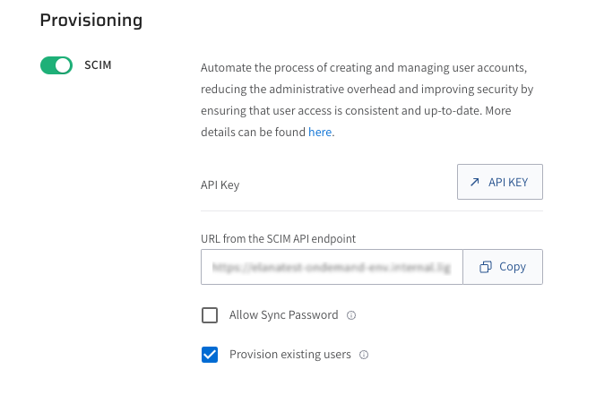

# SCIM provisioning using Okta

Lightrun supports using the open standard System for Cross-domain Identity Management (SCIM) to:

- Grant users in your company seamless access to the Lightrun Application using their Okta credentials.
- Add, remove, and assign your users in your organization.
- Note that as of version 1.22, our support is limited to pushing new users and profile updates. We do not currently offer support for importing data (from Lightrun to Okta) or managing groups (push or import). 

For more information, see [SCIM provisioning Overview](scim.md).

## Prerequisites
- The Lightrun SCIM feature is only available to users on our Enterprise plan; please contact our Support team for more information.
- Supported from Lightrun version 1.22 and higher.
- Lightrun supports Cross-domain Identity Management (SCIM 2.0)
- Enable SSO in the **Identity Configuration** page located under the **Identity and Access Management** tab. For more information, see [SSO](sso.md).
- Generate a dedicated API Key for your integration with SCIM. For more information, see [Lightrun System API Keys](api-keys.md).

## Set up SCIM in Lightrun 

1. Log in to your Lightrun account.
2. In the **Identity and Access Management** tab > **Identity Configuration** > **Provisioning** section > **SCIM**.

    

3. To enable SCIM, click the **SCIM** toggle.
4. In the **SCIM** page, copy and save the following URLs:
   
   - In the **API key** field, click **API KEY** to be routed to the **API key** page. You will need to generate an API Key and copy it to Okta’s SCIM settings. The API Key is used for authentication and authorization between the SCIM server with and the connected Lightrun Management portal.

   - In the **URL from the SCIM API endpoint** field, click **Copy** and save the URL.

Proceed to configure SCIM in Okta.

## Configure SCIM in Okta

##### TO CONFIGURE LIGHTRUN-SCIM INTEGRATION IN OKTA

1. In Okta, go to the Lightrun custom app in Okta located under **Okta > Application > select lightrun's app**,  and open the **General** tab.
2. in **App Settings** section, click **Edit** in App Settings section, and then set **Enable SCIM provisioning** to true, and click **Save**.
3. Go to **Provisioning** tab, click **Edit** in the **SCIM Connection** section, and enter the following fields:
   - For the **SCIM connector base URL**, paste the URL you copied from the **URL from the SCIM API endpoint** field in the SCIM page in your Lightrun Management Portal. 
   - **Unique identifier field for users**:  Enter **userName**
   - **Push New Users**: Select the checkbox 
   - **Push Profile Updates**: Select the checkbox 
   - **Authentication Mode**: Select **HTTP Header** from the list
   - Under HTTP Header section, in the **Authorization** field, paste the SCIM token you copied from OAuth Bearer Token in the **SCIM** page in your Lightrun Management Portal
4. To verify the configuration, select **Test Connector Configuration**.
5. Click **Save**.

   If everything was set up correctly, the success modal should appear.

6. Click **Save**.

   Proceed to provision Lightrun users in Okta.

6. Select **Provisioning to App Settings**.
7. Click **Enable** for these fields: 
   - Create Users
   - Update User Attributes
   - Deactivate Users 
8. Scroll down to the **Attribute Mappings** section.
9. Click **Go to Profile Editor**.

   The **Profile Editor** page opens.

10. In the **Lightrun to Okta User** tab, change the email mapping from **appuser.email** to **appuser.userName**.
    
11.  In the **Assignments** tab, proceed to assign the Lightrun App to users.
    
   As the users are assigned to the Lightrun app, they will automatically be added and displayed as Read-Only in the **Users Management** tab under the **Settings** section of the Lightrun Management Portal.

