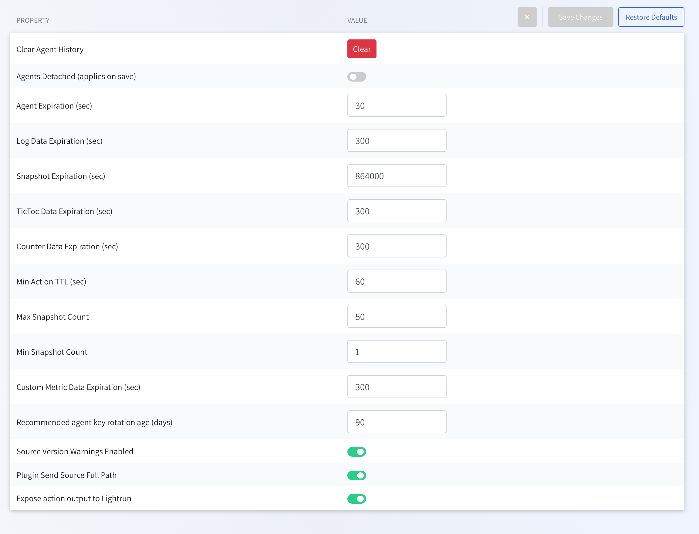

# Manage services 

You can manage certain service configurations for your developers directly from the Management Portal.

--8<-- "ux-reference/manager-role-only.md"

!!! tip
     You can also manage many of these properties and others directly from the agent.config file or from the terminal.
###### To manage your service configurations

1. Log in to your Lightrun account.
2. Click **Settings** on the top right hand side of your screen to navigate to the Settings dashboard.
3. Select **Service configuration** under **Compliance** in the Settings dashboard sidebar.

The following table describes the services and actions you can perform from this page: 

| Option                       | Type/unit | Default | Description |
| ----------------------------- | -------- | ----------- | ----------------------------- |
| Clear Agent History | Button |  | Clears all agent activity from the cache. |
| Agents Detached (applies on save) | Toggle |  | Shuts all agents down when enabled. |
| Agent Expiration [sec]       | Seconds | 30 | This is the time it takes for the server to delete inactive agents  |
| Log Data Expiration [sec]    | Seconds | 10000 | Log data older than this is deleted |
| Snapshot Expiration [sec]    | Seconds | 60 | Snapshot data older than this is deleted |
| TicToc Data Expiration [sec] | Seconds | 300 | TicToc data older than this is deleted |
| Counter Data Expiration [sec] | Seconds | 300 | Counter data older than this is deleted |
| Min Action TTL [sec]         | Seconds | 60 | Minimum time you can set for action TTL |
| Max Snapshot Count           | Hits | 50 | Maximum hit count value you can set for snapshots |
| Min Snapshot Count | Hits | 1 | Minimum hit count value you can set for snapshots. |
| Custom Metric Data Expiration [sec] | Seconds | 300 |  |
| Recommended agent key rotation age [days] | Days | 90 | Set a time frame after which an indication signifying the need for key rotation is added to an agent key.     *The text color of an agent key age changes to red after the key age passes the Recommended agent key rotation age period.*|
| Source Version Warnings Enabled | Toogle | Enabled | Disable source version warnings. |
| Plugin Send Source Full Path | Toggle | Enabled | Send filename full path to Lightrun plugin. |
| Expose action output to Lightrun | Toggle | Enabled | Display action results via your application's standard output only or Display action results in Lightrun Plugins and integrations.    Note - disabling this feature will limit your available action types to Logs and Metrics only. |
