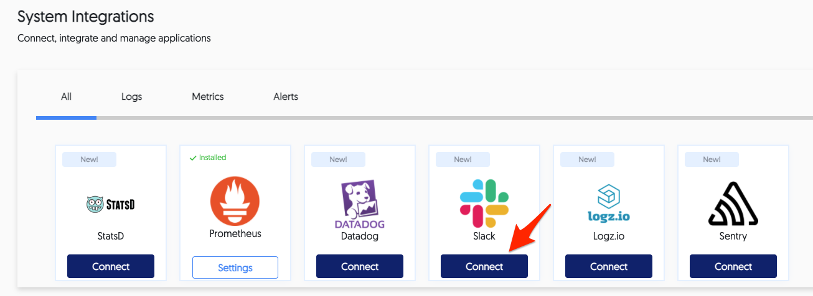
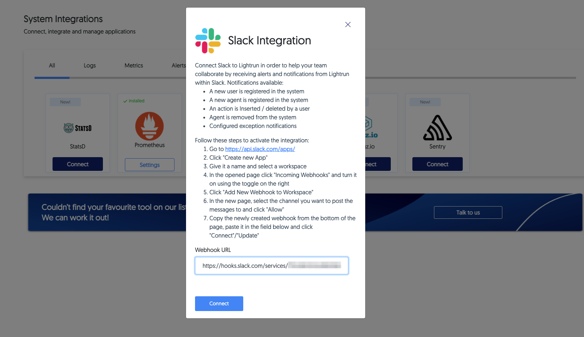

# Lightrun Alerts with Slack Overview

There is a large amount of application-level information that can be hard to acquire in real-time. Lightrun logs, snapshots and metrics are - by design - pieces of real-time, code-level information that can shed a light on what's happening inside your production machines, without the need to redeploy a version with more or better logging.

While receiving the information immediately might be desirable for some cases, there are many occasions where you **don't know** when a specific code path will be reached. In those cases, it might be useful to place the Lightrun Action, and then get an alert when it is "hit" (i.e. when the information is available).

To answer this need, Lightrun Management Servers (including the [Lightrun SaaS](https://app.lightrun.com)) offer a built-in Slack integration.

## Configuration

The Lightrun Managemnet Server (including the [SaaS version](https://app.lightrun.com)) comes with the Slack integration disabled by default.
In order to enable it, visit the System Integrations page (available under the Manager menu for users with the role of Manager and above), and click "connect":

In the menu that opens, follow the instructions to add an incoming webhook for your Slack workspace:

And you should be good to go!

#### A note about Slack channels

There is no restriction on the type of channel you use to receive Lightrun Slack alerts in:

- It can be a channel you created specifically Lightrun alerts
- It can be an existing channel with existing conversations and/or other bots
- It can be a public channel
- Or it can be a private channel

The only requirement is that it exists when you set up the integration.
