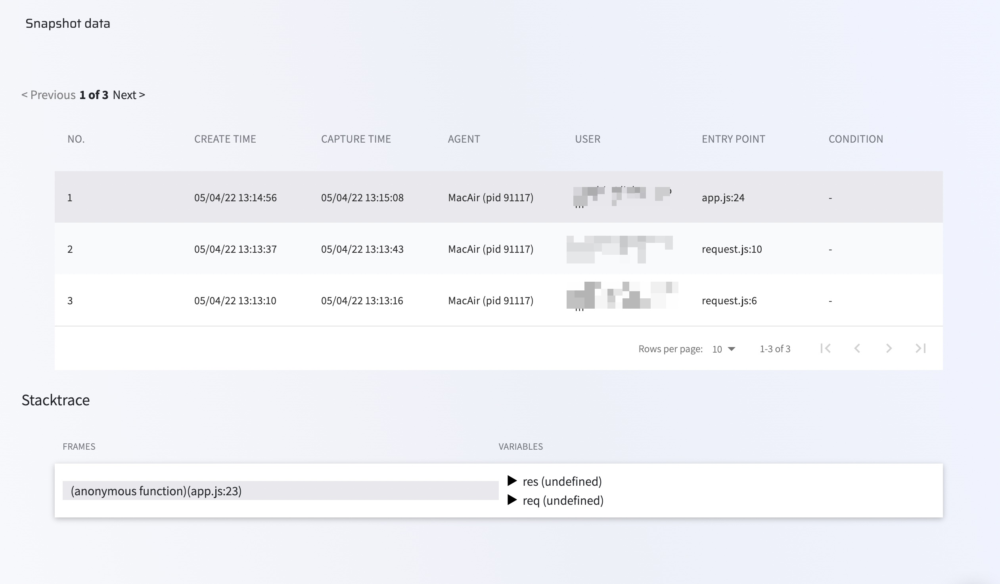

# Snapshot data

As your team works with Lightrun, they can dynamically insert snapshots to track information based on a variety of conditions.

Once a snapshot is inserted into the application, the stacktrace can be viewed from the IDE and from the Lightrun app in your browser. You can learn more about Lightrun Snapshots [here](/actions/snapshots).

###### To view snapshot data in your Management Portal

1. Log in to your Lightrun account
2. Navigate to **Data explorer**
3. Select **Snapshots**

The **Snapshot** screen loads and appears similar to the following:

The screen is divided into two tables as follows:
      

- A list of snapshots and their creation details appears at the top
- Stacktrace details

The following table describes the data available in the first table: 

| Column    | Description                                                  |
| --------- | ------------------------------------------------------------ |
| No   | The unique identifier assigned to the snapshot by the system    |
| CREATE TIME | The time at which the snapshot was created                        |
| CAPTURE TIME     | The time at which the snapshot was actually taken. |
| AGENT       | The agent or tag to which the snapshot was attached. |
| USER       | The user who inserted the snapshot.  |
| ENTRY POINT       | The line of code at which the snapshot was inserted. |
| CONDITION       | If relevant, displays the condition that was used for the snapshot. |

Click on a snapshot to view the stacktrace data in the Stacktrace details table. 

The following table describes the data present in the Stacktrace details table:

| Column    | Description                                                  |
| --------- | ------------------------------------------------------------ |
| FRAMES   | Each frame represents a single snapshot.    |
| VARIABLES | Displays all related details for the selection in the Frame column.                        |
