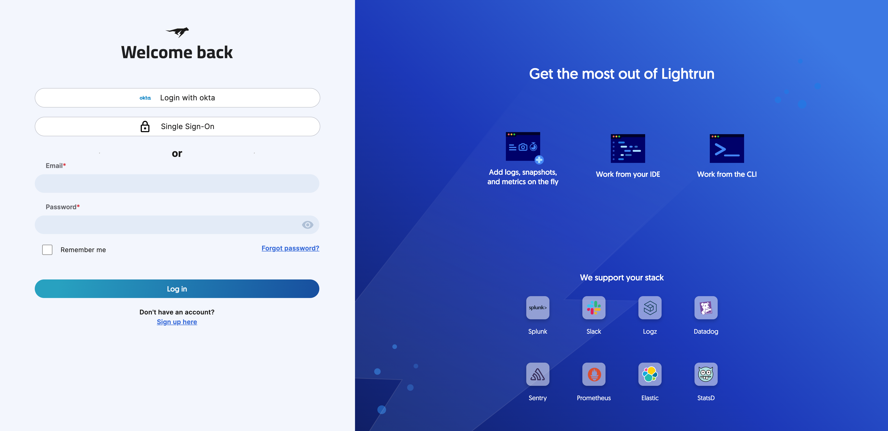
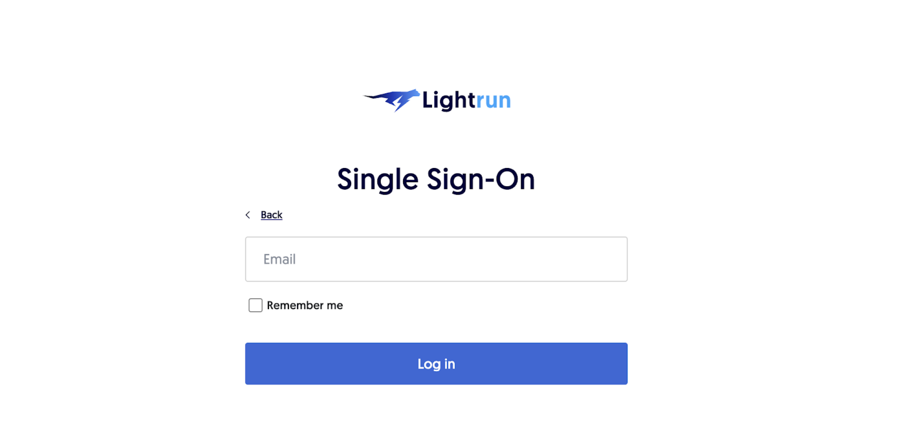

# Log in to Lightrun using Single Sign-On (SSO)

Lightrun allows organizations to manage their employees' access to Lightrun with an external Identity Provider (IDP) like Okta, Azure AD, using the Single Sign-On (SSO) feature.
For more information on configuring SSO, supported SSO protocols, accepted IDP providers, and what to expect after configuring SSO for your organization, see [SSO Overview](sso.md).

###### TO LOG IN TO YOUR LIGHTRUN ACCOUNT WITH SSO

1. Navigate to the Lightrun Management Portal login page.
    
2. Click the **Single Sign-On** button to open the Single Sign-On page.
3. Enter your email address and click **Log in**.
   
   A login link will be sent to your email address.
4. Click the link to redirect to your organization's configured IDP provider to authenticate your Lightrun account.
