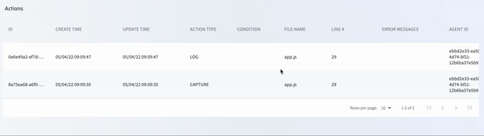

# Manage team actions
Every time a user inserts an action (Logs, Snapshot, Metric, Counter, Duration) directly from their IDE plugin or the CLI, that action is stored and can be managed from the Management Portal by all users on the account.
###### To view your action details from the Management Portal 

1. Log in to your Lightrun account
2. Navigate to **Entities**
3. Select **Actions**

The **Actions** screen loads and appears similar to the following:
	

The following table describes the present data: 

| Column         | Description                                                  |
| -------------- | ------------------------------------------------------------ |
| ID             | The unique ID assigned to this action by the system.         |
| CREATE TIME    | The timestamp for when the action was added to the code.     |
| UPDATE TIME    | The timestamp for the last time changes were made to this action. |
| ACTION TYPE   | The type of action. Can be: CAPTURE (snapshot), TICTOC, LOG, COUNTER, SET_VALUE, CUSTOM_METRIC. |
| CONDITION     | The condition configured for this action.                    |
| FILE NAME      | The name of the file where this action was inserted.         |
| LINE #         | The line number in the file where this action was inserted.  |
| ERROR MESSAGES | All error messages on the action whenever there is an error preventing the action from running or from running correctly. |
| AGENT ID       | The ID of the agent or the name of the tag to which the action is attached. |
| OWNER USER     | The name of the user who added this action.      |

Click **Delete** on the last column of an action row to delete the action.