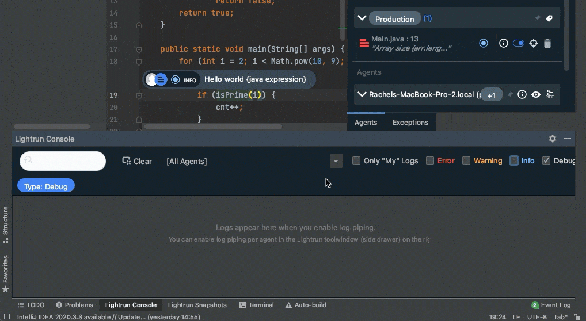

# Java troubleshooting guide

Sometimes issues may arise that interfere with smooth running. We've done our best to gather a list of some more common issues and possible solutions.

## System error messages

| Error        | Description                 | How to fix                 |
| ------------- | --------------------------- | -------------------------- |
| `Encountered an issue with a Lightrun PII Redaction pattern. Please contact your admin for support.`|You cannot add an action to your code because a faulty PII redaction pattern was defined.| Try the following: <br> <ul><li> Check that the PII Redaction patterns are valid in the PII Redaction page in the Lightrun Management Portal and test the redaction process.</ul></li>|
| `An exception occurred: java.lang.NullPointerException.`| Thrown during the evaluation of an expression/condition. | Try the following:  <br><ul><li> In the Management Portal > PII Redaction page, select the pattern and run it in the [Regex tester](/piiredaction/configure-pii-redaction/#configure-a-custom-pii-redaction-pattern).</ul></li> <ul><li> Fix the expression/condition to avoid accessing properties with null value or methods returning a null value.</ul></li>
| `Collision in breakpoint location on the same tree.`| Dependent on the metric type: <br><ul><li> Tic & Toc metric: <br>If both the start and the end of a Tic & Toc metric are placed on the same line.</ul></li> <ul><li> Method duration metric: Could not determine all the method exit points.</ul></li>| Try the following, based on the action: <br><ul><li> Tic & Toc metric: <br>   Place the Lightrun action on two different lines of code.</ul></li><ul><li>Method Duration metric: Use a Tic & Toc metric instead.</ul></li>|
|`Expression could not be compiled.`| The expression contains a syntax error and could not be compiled.| Try the following:  <br><ul><li>Validate your expression. Applicable when writing expressions using Java, Scala, or Kotlin.</ul></li>|
| `General agent error at %`| The variable used in the expression was not found. | Try the following: <br><ul><li> Ensure that your application is compiled with debug symbols.</ul></li><ul><li> Verify that the identifier is available within the Lightrun action scope. Variables can be located in an inner block and may not be directly accessible from the method's block. Ensure that no other agent is running simultaneously.</ul></li>
| `The%method %is undefined for the type %.`| Method not found.| Try the following: <br><ul><li> Attempt type casting in the condition/expression field.</ul></li> <ul><li>Specify the relevant package name in the condition/expression field.</ul></li>|
|`Stack overflow`| Amount of call stack memory allocated by the JVM is exceeded.| Try the following:<br><ul><li> Make sure your expression/condition doesn't create a deep stack depth.</ul></li>
|`calling % is not allowed`| State changing method is not authorized to be used in an expression/condition.</ul></li>| Try the following:<br><ul><li> Verify that the expression/condition is not calling a method that is not read-only (state changing).</ul></li>|
|`Method execution uses too many classes, which can affect application performance`| The executedmethod relies on, or interacts with a large number of classes.|Try the following:<br> <ul><li>If your expression calls a method, try referring to a variable. </ul></li><ul><li>Change the `expression_max_classes_load_quota command-line` flag (default is 50).</ul></li>|
|`The identifier % is ambiguous (possible matches: %`| There are possibly multiple classes sharing the same name. Could not determine which of them should be used when evaluating the expression.| Try the following:<br> <ul><li> Use a fully qualified package name for the ambiguous identifier.</ul></li>
|`Internal error at %`| The agent couldn't perform the requested operation.| Try the following: <br> <ul><li>  Ensure that you are not  using another debugger in parallel to Lightrun. </ul></li><ul><li> Validate that there is no `-jdwp` flag in the JVM arguments.</ul></li>|
|`Cancelled the condition evaluation % might affect the application performance%`|Condition exceeds condition quota.|Try the following: <br> <ul><li>Simplify your condition.</ul></li><ul><li>Change the quota configurations for your agent. </ul></li><ul><li>Use `IGNORE_QUOTA` role if this condition can't be modified. Please note that it may have performance impact.</ul></li><ul><li>The condition is called too many times. Change the condition. |
| `The agent couldn't find the given filename. Verify the action filename.`| The agent couldn't find the file.| Try the following:<br><ul><li>Verify the file name.</ul></li><ul><li>Add the relevant JAR or folder containing debugged class using the `lightrun_extra_class_path parameter`. For more information, see [Configure the Java agent](/jvm/agent-configuration/#additional-command-line-flags).</ul></li><ul><li>Verify that the action is placed on an application which contains the debugged class by choosing the correct agent or tag.</ul></li>
|`Invalid expression syntax`| Expression has a syntax error.| Try the following: <ul><li>Validate the syntax, ensuring that expressions follow Java syntax conventions (or Scala, Kotlin when applicable).<ul></li> |
| `No code found at &`|No executable code found on the requested line.| Try the following: <ul><li>Make sure you are using the same source version as the one running in the target environment.</ul></li><ul><li>Place the Lightrun action on a valid line of code. For example, you cannot place an action on an empty line of code.</ul></li><ul><li>Confirm that the Lightrun action was not inserted into your `__main__` method</ul></li>|
| `Type mismatch`| There is an attempt to use a value in a way that is incompatible with its data type, violating the expected type in a given context.| Try the following: <ul><li>Compare a boxed variable with an unboxed variable.</ul><l/i> <ul><li>Assign a boxed variable to an unboxed variable. <br> Assign an unboxed variable to a boxed variable. </ul><l/i> <ul><li>Enable `boxing_unboxing_enabled` in your [agent configuration](/jvm/agent-configuration/).</ul></li>| 
| `The agent couldn't find the given filename. Verify the action filename` | Agent couldn't find the file. | Try the following: <ul><li>Verify the file name.</ul></li> <ul><li>Add the relevant jar to `lightrun_extra_class_path`.</ul></li><ul><li>Verify that you selected the correct agent or tag.</ul></li> |
| `Identifier % not found` | Variable in expression was not found. | Try the following:<br> <ul><li>Make sure your application is compiled with debug symbols.</ul></li><ul><li>Verify the identifier is available in the Lightrun action scope.</ul></li> | 
| `Internal error at %` | The agent couldn't perform the requested operation. | Try the following: <br> <ul><li>Verify you don't use another debugger in addition to Lightrun.</ul></li>| 
| `Invalid expression syntax` | Expression has syntax errors. | Try the following: <br> <ul><li>Validate your syntax and make sure you use Java syntax for expressions (Also when using Scala or Kotlin).</ul></li> | 
| `Method xyz blocked (INVOKEDYNAMIC not supported)`| A type mismatch in your Java expression or condition statement. For example, when you try to compare a boxed variable with an unboxed variable, assign a boxed variable to an unboxed variable, assign an unboxed variable to a boxed variable, etc. | Try the following: <br><ul><li> Enable `Invokedynamic` support in your JVM agent configuration. For more information, see [Enable Invoke Dynamic](/jvm/agent-configuration/#to-enable-invokedynamic-instructions-support).</ul></li>

## General issues

### Self-signed certificate is blocked {#_self_signed_certificate_is_blocked}
    
Troubleshooting for this issue can vary depending on your browser, its version, or your operating system. 
    
For guidance on resolving certificate issues with popular browsers and operating systems, refer to the following articles:
    
- [Getting Chrome to accept self-signed localhost certificate (per
        Chrome
        version)](https://stackoverflow.com/questions/7580508/getting-chrome-to-accept-self-signed-localhost-certificate)
    
 - [Ubuntu: Adding a self-signed certificate to the "trusted
        list"](https://unix.stackexchange.com/questions/90450/adding-a-self-signed-certificate-to-the-trusted-list)
    
- [Creating and Trusting Self-Signed Certs on MacOS and
        Chrome/Safari](https://www.andrewconnell.com/blog/updated-creating-and-trusting-self-signed-certs-on-macos-and-chrome/)
    
- [How to trust a self-signed SSL certificate in IE11 and
        Edge](https://medium.com/@ali.dev/how-to-trust-any-self-signed-ssl-certificate-in-ie11-and-edge-fa7b416cac68)
    
- [How do you get Chrome to accept a self-signed certificate on
        Win10](https://www.pico.net/kb/how-do-you-get-chrome-to-accept-a-self-signed-certificate)

## Plugin issues

### Can't see the Lightrun plugin sidebar
    
If you can't see the plugin from your IDE, check that:
    
- The IntelliJ default is not set to **Collapse**. 
    
- The plugin is installed and activated.
    
- Check the plugin's settings by navigating to **View** > **Tool Windows** > **Lightrun**.

### Can't sign in from the plugin

If you can't sign in to the server from the plugin, check that:
    
- There is connectivity to the server (cloud).
    
- The Lightrun Server URL in the plugin's settings (found under the IDE's **Preferences / Settings** > **Lightrun**) is correct. Ensure it matches the URL displayed in the browser page from which you're attempting to authenticate.
    
### Can't sign in from the browser for the plugin or CLI
    
 If you can't log in from your browser, check that: 
    
- The client can communicate with the server (the cloud). Ensure it matches the URL displayed in the browser page from which you're attempting to authenticate.
    
- There may be a problem with the embedded browser in your IDE. Try disabling **Use Embedded Browser** option for IntelliJ from the IDE Settings menu and then try logging in again. 
    
## Agent issues

### Agents don't appear in the Agents tab in the Lightrun sidebar
    
 If agents don't appear in the IDE, it may indicate that they are not currently running on the server where your application is located. If you're certain that the agent is running, then this error could be due to connection or authentication issues on the client side.
    
If you are unable to see agents in the IDE, try the following:
    
1. Validate that you have selected the correct agent pool.

2. Restart the IDE.
    
3. [Re-authenticate Lightrun from within the IDE](/authenticate-plugin/).
    
If the agents still fail to appear, contact your administrator for assistance.

## Action issues
    
### Lightrun actions in this file were submitted against a different version
    
    
    
This warning appears when one or more actions in the currently open file were set against a different version of the source code. This might occur if you set an action after making edits to the file or someone else, whose source code differs from yours, sets an action on the same file.
    
While this warning can be ignored as does not prevent the activation of the action, it's important to note that actions set on mismatching source code can lead to unexpected behavior. Therefore, it's recommended to address this issue if it arises.
    
To resolve this, try the following:
    
- Ensure the application you are debugging is using the same file as the code that you've opened in your editor (or the editor of whoever set the action).
    
- Try closing and reopening the file.
    
- If the problem persists, disable the warning by clicking **Don't Show this Again** in the notification panel.
    
!!! imp "Important"
    Disabling this notification will also affect how others view the actions that you have set.
    
### Can't see dynamic logs in my IDE
    
Logs only appear in the IDE if piping is configured correctly. If you are unable to see logs, try the following:
    
- Double-check the piping configuration to ensure it's set to **Plugin** or **Both**.
    
- Check all of the **Lightrun Console** filters to ensure you haven't filtered out the dynamic logs you're looking for.

    
    
### Metrics not reported in integrated tool
    
Consider the following troubleshooting steps:
    
- Double-check the configurations for your webhook and application settings, ensuring the credentials used for integration are correct.
    
- Verify that any other [integration settings](/integrations/overview/) are accurate for the third-party platform you're using to ensure our server can successfully send information to it.
    
- Confirm that [piping](plugin.md#piping) is enabled.
    
- After sending logs, allow some time for the platform to index and make them available for search. Typically, this process takes anywhere from seconds to one minute, but occasionally it may take longer.
    
### Can't create a new action
    
Sometimes you can't create an active action for a variety of different reasons, and you may encounter them in the following scenarios: 
    
- You can't create a new action.
- An action you created appears in red in the IDE.
- The only actions that appear in the IDE are for tags.
- You can't find the agent list in the IDE.
    
Try the following:
    
- Ensure that you are logged in by attempting to log out and then log back in. 
    
- Verify that you are attempting to insert the action from a line containing code. In the IDE, ensure the cursor is positioned within your code. In the CLI, double-check the validity of the line number used. 
    
- Confirm the status of the agent. If it's inaccessible, reach out to one of your account managers for assistance.
    
- Check if you are not connected to the correct source code version (the same version currently running with the agent). Try closing and reopening the source code file, ensuring you're opening the file directly from the correct source version. 
    
- Consider upgrading your plugin to the latest version, as it may resolve compatibility issues.
    
### Can't delete an existing action
    
If you can't delete an action, verify that:
    
- You're logged in.
    
- The agent you're using is currently running. Try running [`list-agents`](/cli/cli_reference/#list-agents) to check.

Try the following:

Move the action insertion position to the line following the one for which the log is intended to trigger.
    
### Source file not found
    
This usually happens when the relevant JAR is not on the classpath.
    
When spinning up your application with the Lightrun agent attached, add the `lightrun_extra_class_path` command line argument to fix the problem:
    
 ```bash
    java -agentpath:<PATH_TO_AGENT>/lightrun_agent.so=--lightrun_extra_class_path=<PATH_TO_JAR> YourApplication
 ```

### Expression not allowed

Lightrun blocks expressions that are considered harmful to your server, can overload the Lightrun agent and server, or expressions that carry a large performance penalty.

These prohibited expressions include:

- Expressions that change the state of your application, such as, setting object fields, static fields, or modifying array elements.
- Expressions that involves calling native methods.
- Expressions that create global variables.
- Expressions implementing operations like division by zero, infinite recursions, out-of-bound reads, or null pointer reference.
- Expressions that cause CPU halts.
- Expressions attempting to access external resources.
    
