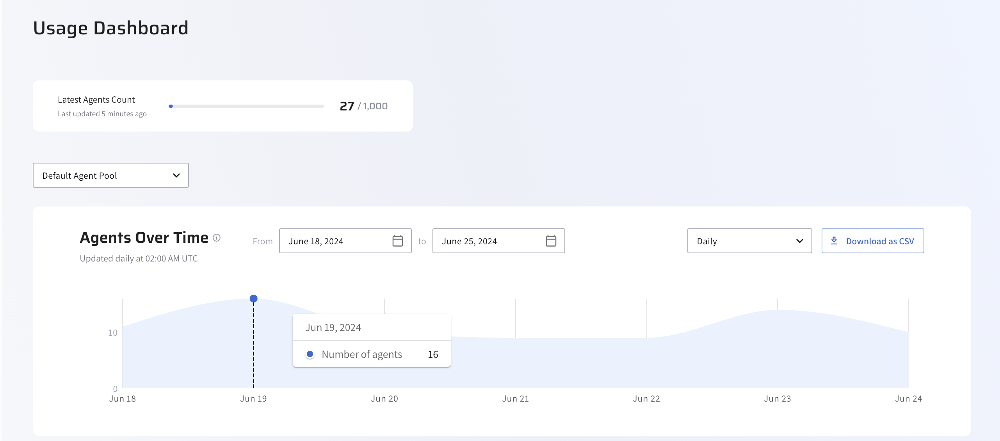
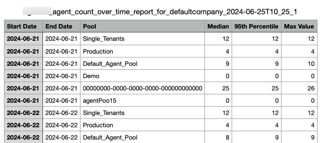

# Gain insights with the Lightrun Usage dashboard

!!!permissmions
    This feature is available for USER_MANAGER users only.

!!!note
    The Usage Dashboard is under limited availability.  Please contact us to inquire about access.

The Usage Dashboard in the Lightrun Management Portal offers valuable insights into your Lightrun agent usage within your organization. This information keeps you informed about your agent consumption, allowing you to optimize usage and plan accordingly for future rollouts.

As you can see in the following dashboard example, the current Lightrun agent count is 27 out of 1000 available agents in your organization. The stats are updated every 5 minutes. In the Agents Over Time graph, there are two peaks of usage on June 19 and around June 23. You can change the date range or select a predefined period: Daily, Weekly, or Monthly.

The different areas of the dashboard are described in the following sections.

## View Agent-related data

To view the **Usage Dashboard**, log in to the Lightrun Management Portal and from **Organization** Settings, click **Usage Dashboard**.

From Lightrun version 1.36, the following insights are available:

- Latest Agent Count
- Agents Over Time view: Track agent usage over time.

### Track Latest Agent Count

The **Track Latest Agent count** bar provides information regarding the number of active agents in your organization.

### View Agents Over Time trend

The **Agents Over Time** trend provides a graph representing the top 95th percentile of active agents in the organization over a period of time. You can apply these filters to gain different insights:

- Date Range: Select a to-and-from date range.
- Predefined Date Range: Select a time date interval: Daily, Weekly, or Monthly.

## Download Agents Over Time report as CSV

1. Log in to the Lightrun Management Portal and from **Organization Settings**, click **Usage Dashboard**.
2. In the **Agent Over Time** section, set the time range and click **Download as CSV**.
    The file is downloaded to your local drive in a CSV format as displayed in the following example.

    

