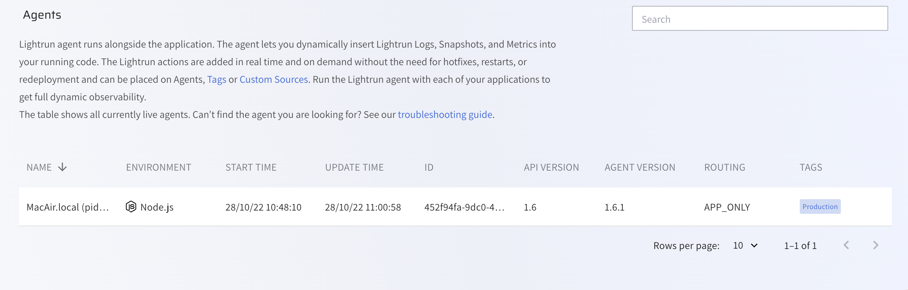

Whenever a Lightrun agent is active, you can view its details directly from the [Management Portal](https://app.lightrun.com/).
###### To view agents from the Management Portal

1. Log in to your Lightrun account.
2. Navigate to **Entities**.
3. Select **Agents**.

The **Agents** screen loads and appears similar to the following: 

The following table describes the present data: 

| Column     | Description                                               |
| ---------- | --------------------------------------------------------- |
| NAME       | The name of the server on which the agent is running. |
| TAGS     | Tags attached to this agent.                               |
| ENVIRONMENT | The application environment. |
| START TIME  | The time at which the agent was started.                   |
| UPDATE TIME | The last time the agent fetched actions from the server.   |
| ID         | The unique agent ID.                                       |
| API VERSION | The Lightrun API version currently implemented.            |
| AGENT VERSION | The Lightrun Aagent version currently implemented.            |
| ROUTING  | The current configuration for log piping.                  |
