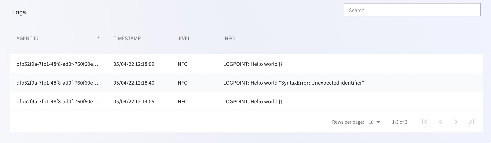

# Dynamic logs

Lightrun makes it possible to insert dynamic logs into your application during runtime and view the Log output immediately without stopping the running code. The inserted log outputs are printed to the agent’s standard output, for example, java.util.logging logger for Java outputs.

All relevant information from any logs that are added to your applications appears directly in the developers' consoles, in the Management Portal, or both. These logs are very useful for troubleshooting and resolving issues in live code. You can learn more about Lightrun dynamic logs [here](/actions/dynamic-logs).

!!! reqs "Important"
     To view logs from the Management Portal, first ensure you've configured piping from your plugin. Only data that has been configured to pipe to the Management Portal or to the Management Portal and IDE appear in the Portal.

     - Visit [here](/logs/#configure-piping) for information on how to configure piping for the Jetbrains plugin. 
     - Visit [here](/vscode/vscode-plugin-dynamic-logs/#viewing-logs-output) for information on how to configure piping for the VScode plugin.

!!! Note
    Logs are sent from the agent to the plugin via the Lightrun management server. As this process is batched, logs may appear with a slight delay.

###### To view log data in your Management Portal

1. Log in to your Lightrun account.
2. Navigate to **Data explorer**.
3. Select **Logs**.

The **Log** screen loads and appears similar to the following: 
  

The following table describes the present data:

| Column    | Description                                                  |
| --------- | ------------------------------------------------------------ |
| AGENT ID   | The unique identifier assigned to the agent by the system    |
| TIMESTAMP | The time at which the log was created                        |
| LEVEL     | The severity level of the log; this is configured per log when inserted in the code |
| INFO      | The formatted text configured when the log is inserted and any relevant errors |
