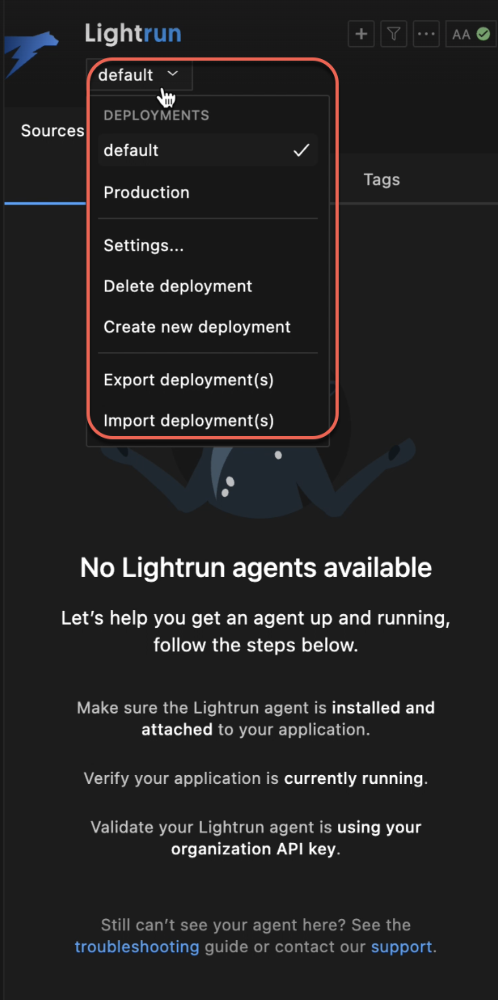
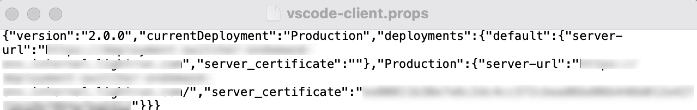
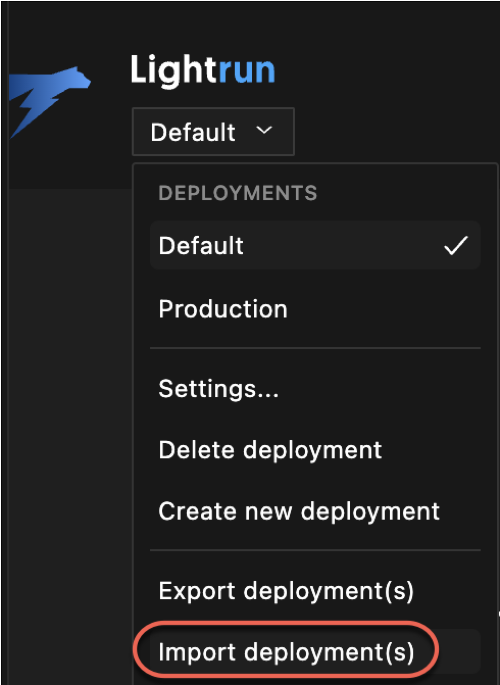
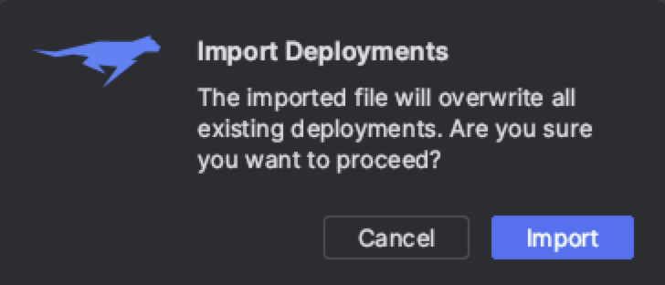
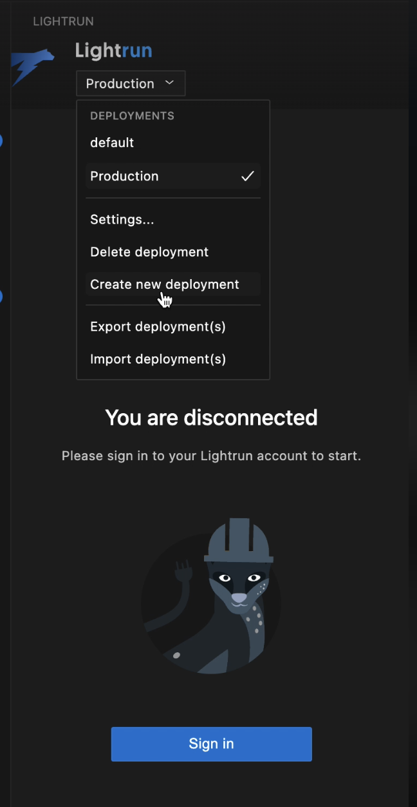
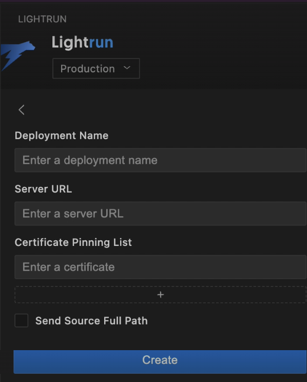

# Switch between deployments in the Lightrun plugin in VS Code

!!! Note
    
    You need a Lightrun Enterprise plan to use the Deployment Switcher functionality. For more information, see [Pricing](https://lightrun.com/pricing/).

    The Deployment Switcher feature applies only to Single-tenant and On-premise environments and is activated upon demand. To enable this feature, please [reach out](mailto:lightrun-ticket@lightrun.com).

From version 1.38, the Lightrun Deployment Switcher is available directly within its plugin in your IDE, is designed for developers in large enterprise organizations who need to debug applications across multiple deployment instances. This feature allows you to seamlessly switch between deployments, such as from `TESTING` to `PRODUCTION` or between regional deployments like `TESTING-EU` and `TESTING-US`.

For example, you might have two deployments set up: `default` and `Production`.

## Rules and guidelines

- The Lightrun server that you first authenticate the Lightrun plugin with is set as the default deployment upon login.

- Deployment settings apply only to your local IDE and do not affect other developers. Any changes or modifications you make are local and specific to your setup. 

- The selected deployment remains active every time you enter your IDE. 

- At least one deployment type must be set in the IDE and cannot be deleted. 
  

## Before you begin

For each deployment type, you will need the full URL of the remote deployment that you wish to access. To obtain this information, please contact the administrator in your organization.

## Set up the deployment switcher in your organization

The Deployment Switcher is designed for large enterprise organizations that manage multiple deployments. We recommend that an administrator or an allocated team member lead the effort for generating and distributing the deployment settings to the users in your organization.

The recommended stages for deploying the Deployment Switcher in the plugin for all the users in the organization are:

1. Administrator tasks:

    a. **Create a list of deployments**: From within the plugin: create a list of deployments.

    b. **Export the list of deployments**: From within the plugin, export the list of deployments to an external file.

    c. **Distribute the file**: Share the exported file with all the relevant developers in the organization.

2. Developer tasks:

   - Import the file:  Use the Import Deployment option available in the Deployment Switch list to import the file.

### Stage 1: [Admins]: Create and export a list of deployments

1. Create a list of deployments. Follow the [Add a new deployment to the deployment switcher](#new) procedure.
2. From the Deployment Switcher list, select **Export deployment(s)**.
    The File Explorer window opens, requiring that you set the location for saving the file on your local drive.
    The file is saved as vscode-client-props in the following format.

    

3. Distribute the file to your developers in your organization with an explanation of how to import the file within the plugin.

### Stage 2: [Developers] Import deployment file

1. Open the Lightrun Sidebar in your VS Code IDE.
2. Click **default** to access the drop-down list, and select **Import deployment(s)**.

    
    
    The following message will open in the right lower window.

    

3. Click **Import** and select the file from your local drive.

    The list is updated automatically. No further action is required.

## Manage deployments

### Add a new deployment to the deployment switcher {#new}

1. Open the Lightrun Sidebar in your VS Code IDE.
2. Click default to access the drop-down list, and select **Create new deployment**.

    

    The deployment details page opens.
    `
    

3. Enter the deployment details:

   - Lightrun **Deployment Name**: Provide an intuitive name to recognize your deployment. For example, Production, Staging, or a geographical location.
   - Lightrun **Server URL**: Provide the full path to your Lightrun server.
   - **Certificate Pinning List**: Add your 64-character sha256 certificate public key hash for pinning.
   - **Send Source Full Path**: Select the check-box to send the source full path.

4. Click **Create**.	

    The new deployment is added to the deployment list and the details are viewable in the right pane.

### Edit deployment settings

You may want to edit deployment settings, such as updating the certificates for the Lightrun Server URL.

1. In the Lightrun plugin, open the deployment list and select the deployment you want to modify.
2. From the drop-down list, select **Settings**.
    
   The Settings page for the relevant deployment appears.

3. Make the necessary changes in the relevant fields.
   
   The changes are automatically saved.

### Delete a deployment 

You can remove any deployment from the deployment list in the Lightrun plugin, except for the last one. This action will only delete the deployment from your local deployment list and will not affect other users.

1. From the deployment list in the Lightrun plugin, select the deployment to delete.

2. From the drop-down list, select **Delete Deployment**.

    The **Delete Deployment** message opens.

3. Click **Delete**.

    The deployment is removed from the list.