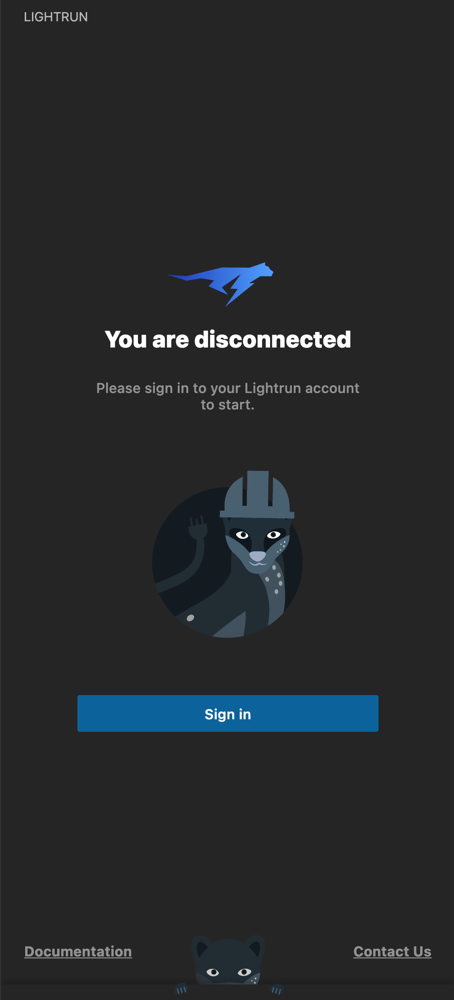
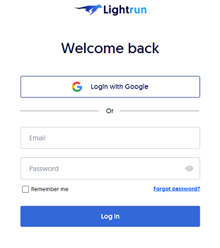
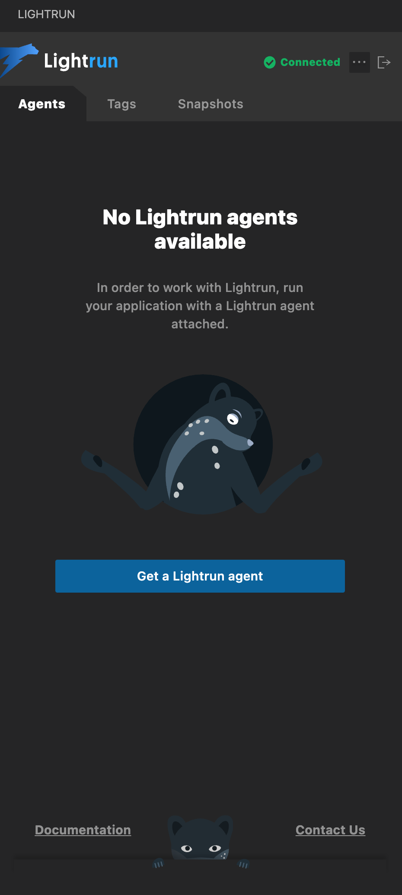

## Authenticating the Lightrun plugin

On each occasion you start to work with Lightrun from the VSCode plugin, you must first authenticate it against your Lightrun account.

!!! reqs "Prerequisites"
    These instructions assume that you have:

    - [Created your Lightrun Account](/create-account/)

    - [installed the VSCode Lightrun plugin](vscode-install-plugin.md){:target="_blank"} in your IDE.

###### To authenticate Lightrun plugin

1. From the VSCode activity bar, click the Lightrun icon  to expand the plugin sidebar.

   {: style="width:25%"}

2. Click **Sign in**.  
   A browser window opens with the Lightrun login page.  
   

3. Log in to Lightrun with your user credentials.  
   After you are logged in, the Lightrun page reloads with a confirmation message. Notice that there is a timeout configured; you might need to re-login if the timeout elapses.

4. Return to VSCode.  
   The Lightrun plugin indicates that the service is connected.  

    {: style="width:25%"}

!!! Note
    If the Lightrun plugin is authenticated successfully, but the **No Lightrun agents available** warning is displayed, this means no agents currently are attached and running with your application.

The next steps are to:

- Run a Lightrun agent with your app, depending on your runtime environment ([Java](../jvm/agent.md){:target="_blank"} | [Python](../python/agent.md){:target="_blank"} | [Node.js](../node/agent.md){:target="_blank"})
- After you run your app with the Lightrun agent attached, you can begin to insert [logs](vscode-plugin-dynamic-logs.md){:target="_blank"}, [snapshots](vscode-plugin-snapshots.md){:target="_blank"}, and metrics. <!-- TODO: [metrics](vscode-plugin-metrics.md){:target="_blank"}. -->
