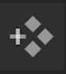

# Dynamic Logs

--8<-- "ux-reference/vscode-plugin-prereq.md"

From the Lightrun plugin for VSCode, you can:

- [Add dynamic logs directly into your running application.](#adding-logs)
- [Manage the inserted dynamic logs.](#managing-logs)

## Adding logs {#adding-logs}

To add dynamic logs to your code, you must open the **Insert a Log** form and enter your preferred log parameters.

### Opening the **Insert a Log** form

There are two ways to open the **Insert a Log** form.

1. [From the **Agents** or **Tags** tab.](#agentsortabs)
2. [From a code line in your VSCode editor.](#codeline)

#### Agents or Tags tab {#agentsortabs}

1. Open the Lightrun Sidebar in your VSCode IDE.
2. Navigate to the **Agents** or **Tags** tab and select an agent or tag.
3. Click the **Add Action** icon  on the agent or tag.
4. Select **Log** in the menu that appears.

   The **Insert a Log** form should appear similar to the following image.
   

#### Code line method {#codeline}

1. Go to the line in your application source code where you'd like to insert the log. Make sure to use the source code version currently deployed to your remote app (where the agent is attached).
2. Right-click to open the VSCode context menu.  
   
3. From the VSCode context menu, click **Lightrun...**.  
   The VSCode Command Palette opens with a list of Lightrun plugin options.  
   
4. From the Command Palette, select **Insert a Log**  
   The **Insert a Log** form should appear similar to the following image. 
   

### Entering Log parameters

Complete the fields in the **Insert a Log** form, as follows:

| Fields | Description |
|--------|-------------|
|**SOURCE**| From the available options in the dropdown list, bind the action to a specific agent, tag, or custom source.  *Click the  icon to create a new custom source.* |
|**FILENAME & LINE**| The source code file into which you're inserting the action. The default path is to the source code file from which you're currently working. |
| **LOG MESSAGE** |The actual log string. Use expressions such as `My variable is {var}`, including method invocations such as: `Method value: {myMethod() + 5}`. |
| **LOG LEVEL**  | Select an appropriate log level: INFO, ERROR, DEBUG, WARN.  Once configured, logs can also be filtered by the LOG LEVEL attribute in the Lightrun console. |
 |**CONDITION**| The condition of an `if` statement, used to limit the execution of the action.  For example, The condition `myVar % 7 == 0` limits the action (log, snapshot, metric) output so that it only prints for variables that are divisible by 7.|
|**LIFETIME** | The time after which the action ceases to track code behavior and is automatically disabled; default = 1 hour.|
|**TARGET**| Select your preferred action output taget. You can pick either:  - **Stdout** - Logs are routed only to your application's standard output. - **Plugin** -  Logs appear in the Lightrun Console, the Lightrun Management Portal, and configured integrations. or both options at once.|

Click **Create** to insert the dynamic log into your code.  

## Managing logs {#managing-logs}

Upon log creation:  

- In the VSCode editor, a  icon will appear next to the selected code line.  
- A new log action will appear under the selected source (agent or tag) in the Lightrun sidebar.
  

You can disable, delete, or edit a log directly in your IDE.

##### To disable a Dynamic Log

1. Hover your cursor over the relevant log in the Lightrun sidebar.  
   A toggle switch should appear.  
   
2. Click the toggle switch from blue (on) to grey (off).
3. To resume logging, click the toggle back to blue.

##### To duplicate a Dynamic Log

1. Hover your cursor over the relevant log in the Lightrun sidebar.
2. Right-click and select **Duplicate**.
   
   

3. Go to the selected destination and right-click and select **Duplicate**.

##### To delete a Dynamic Log

1. Click the menu icon **...** next to the relevant log in the Lightrun sidebar.
2. Select **Delete** from the menu that appears.

   

##### To edit a Dynamic Log configuration parameters

1. Click the menu icon **...** next to the relevant log in the Lightrun sidebar.

   

2. Select **Edit** from the menu that appears to open the **Edit a Log** form.

   The **Edit a Log** form should appear similar to the following image.
   

3. Edit your log configuration data in the **Edit a Log** form.

