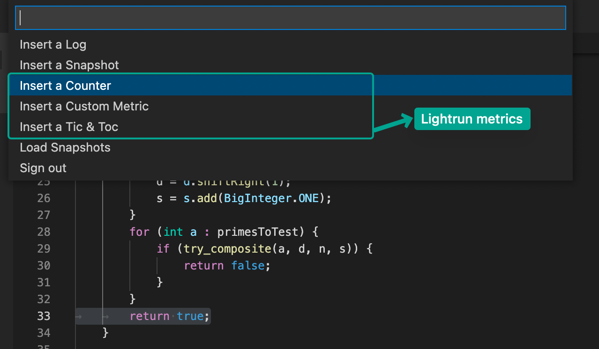
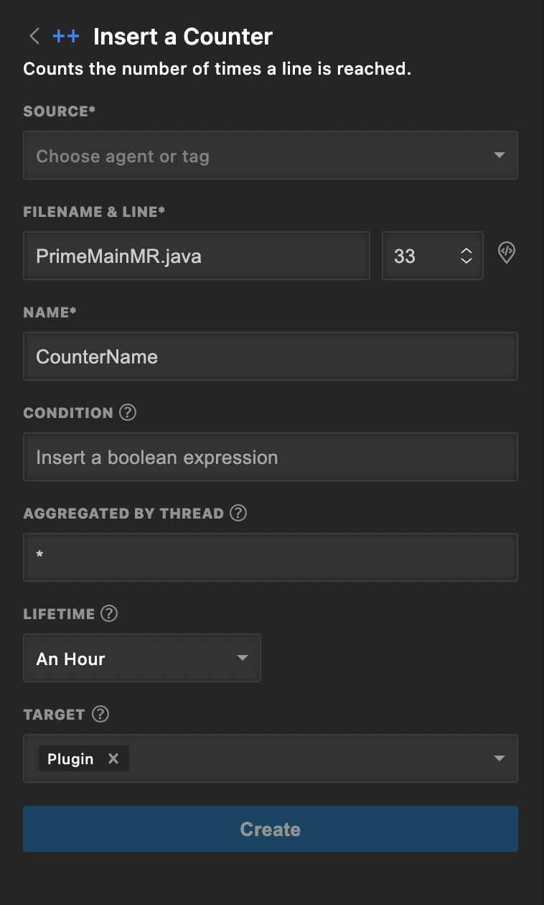
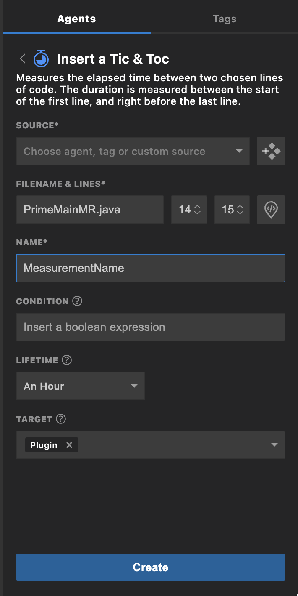
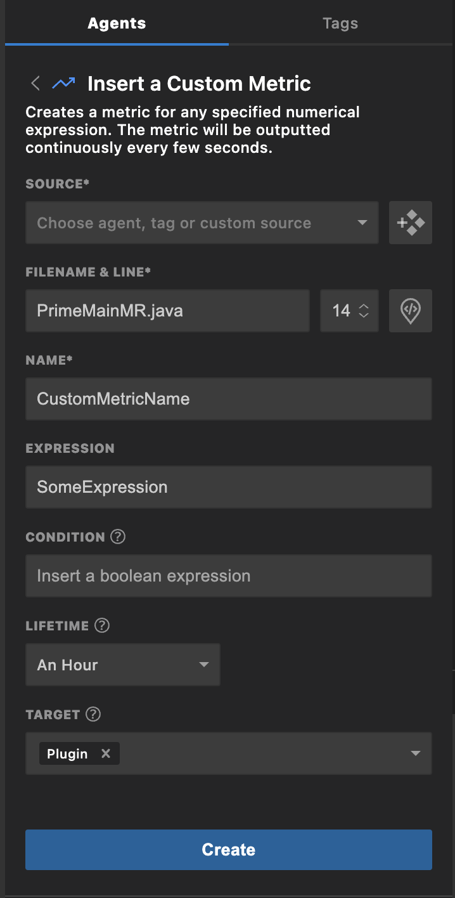
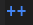
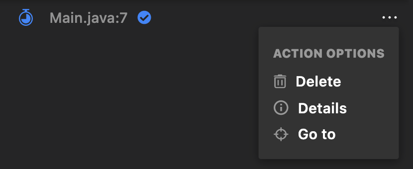
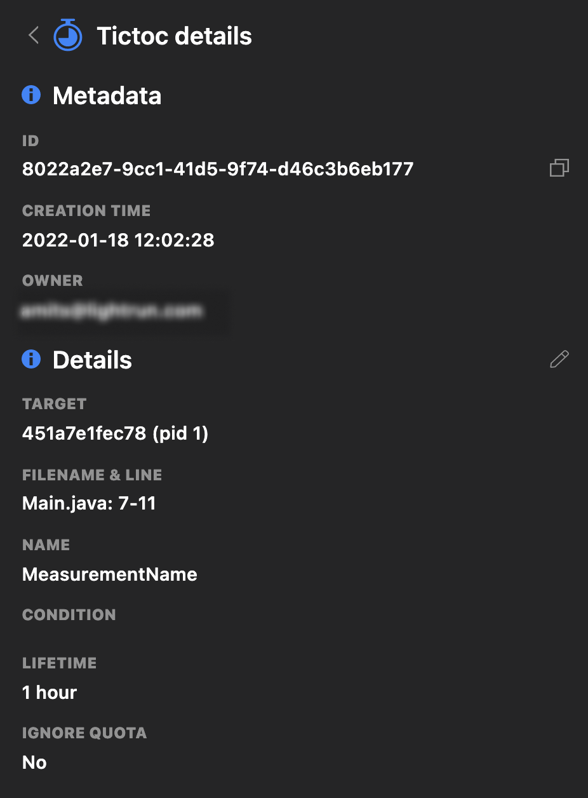
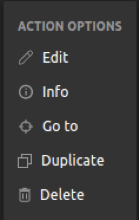

# Metrics

The Lightrun plugin for VSCode currently provides three different metrics action for monitoring the performance of your code and identifying issues:

- [Counters](#counter) - Counts the number of times a specific line of code is reached.

- [Tic & Toc](#duration) - Measures the elapsed time between two selected lines of code within a function.

- [Custom Metrics](#custom) - Create customized metrics, using parameters and simple or complex expressions that return a `long int` result.

The following subsections describe:

- [How to add a metrics action to your running application.](#adding)
- [Configuration option for each metric action.](#configuring)
- [Managing a metrics action directly from your VSCode IDE.](#managing-metrics)

--8<-- "ux-reference/vscode-plugin-prereq.md"

!!! info "Support"
  
    Metrics are currently supported only for Java/JVM applications.

## Adding Metrics {#adding}

There are two ways to insert a Lightrun metric into your code.

1. [From the **Agents** or **Tags** tab.](#agentsortabs)
2. [From a code line in your VSCode editor.](#codeline)

#### Agents or Tags tab {#agentsortabs}

1. Open the Lightrun Sidebar in your VSCode IDE.
2. Navigate to the **Agents** or **Tags** tab and select an agent or tag.
3. Click the **Add Action** icon  on the agent or tag.
4. Select your preferred metric from the menu that appears.

   

#### Code line method {#codeline}

1. Go to the line in your application source code where you'd like to insert the metric. Make sure to use the source code version currently deployed to your remote app (where the agent is attached).
2. Right-click to open the VSCode context menu.  
   {: style="width:75%"}
3. From the VSCode context menu, click **Lightrun...**.  
   The VSCode Command Palette opens with a list of Lightrun plugin options.  
   {: style="width:50%"}
4. Select your preferred metric in the VSCode Command Palette.

## Configuring Metrics {#configuring}

### Counter

A Lightrun Counter counts the number of times a specified line of code is reached and outputs the data periodically to the configured action target.

With a Lightrun Counter output, you can obtain a deeper insight into the state of your application's code, at any level of detail, from expressions and method calls to individual variables.

The **Insert a Counter** form should appear similar to the following image.

The following table describes the available configuration options.

| Fields | Description |
|--------|-------------|
|**SOURCE**| From the available options in the dropdown list, bind the action to a specific agent or tag. |
|**FILENAME & LINE**| The source code file into which you're inserting the action. The default path is to the source code file from which you're currently working.  Use the up/down arrows to change the line number for inserting the counter. |
|**NAME**| A meaningful label for the metric. |
|**CONDITION**| The condition of an `if` statement, used to limit the execution of the action.  *The condition `myVar % 7 == 0` limits the action (log, snapshot, metric) output so that it only prints for variables that are divisible by 7.*|
|**AGGREGATED BY THREAD**| Group the metric based on thread names. Specify the required thread name prefix, followed by an asterisk.   - If you specify just `*`, the counter increments for all threads that reach a given line of code (the same as the default).  - If you specify `mythread*`, all threads with the prefix `mythread` are considered as a single group; the counter increments only if a member of the `mythread*` group reaches the given line of code.|
|**LIFETIME**| The time after which the action ceases to track code behavior and is automatically disabled; default = 1 hour.|
|**TARGET**| Select your preferred action output taget. You can pick either:  - **Stdout** - Logs are routed only to your application's standard output. - **Plugin** -  Logs appear in the Lightrun Console, the Lightrun Management Portal, and configured integrations. or both options at once.|

!!! tip

    Clicking the **Get filename & line**  icon automatically loads the file name and line number at which the cursor currently is positioned within the VSCode editor.

!!! note

      Metrics (standard and custom) continue to be published every few seconds, even if the code didn't reach the code line where the metric is inserted.

### Tic & Toc

The Tic & Toc metric measures the elapsed time of code execution between two specified lines, Tic (start line) and Toc (end line), in the same code block.

The **Insert a Tic & Toc** form should appear similar to the following image.

!!! Note
    The Tic (start line) and Toc (end line) both must be positioned inside the same code block.

The following table describes the available configuration options.

| Fields | Description |
|--------|-------------|
|**SOURCE**| From the available options in the dropdown list, bind the action to a specific agent or tag. |
|**FILENAME & LINE**| The source code file into which you're inserting the action. The default path is to the source code file from which you're currently working.  Use the up/down arrows to change the line number for inserting the counter. |
|**NAME**| A meaningful label for the metric. |
|**CONDITION**| The condition of an `if` statement, used to limit the execution of the action.  *The condition `myVar % 7 == 0` limits the action (log, snapshot, metric) output so that it only prints for variables that are divisible by 7.*|
|**LIFETIME**| The time after which the action ceases to track code behavior and is automatically disabled; default = 1 hour.|
|**TARGET**| Select your preferred action output taget. You can pick either:  - **Stdout** - Logs are routed only to your application's standard output. - **Plugin** -  Logs appear in the Lightrun Console, the Lightrun Management Portal, and configured integrations. or both options at once.|

!!! tip

    Clicking the **Get filename & line**  icon automatically loads the file name and line number at which the cursor currently is positioned within the VSCode editor.

!!! note

      Metrics (standard and custom) continue to be published every few seconds, even if the code didn't reach the code line where the metric is inserted.

### Custom Metric

You can insert your own customized metrics expressions that evaluate to a long integer result.

The **Insert a Custom Metric** form should appear similar to the following image.

The following table describes the available configuration options.

| Fields | Description |
|--------|-------------|
|**SOURCE**| From the available options in the dropdown list, bind the action to a specific agent or tag. |
|**FILENAME & LINE**| The source code file into which you're inserting the action. The default path is to the source code file from which you're currently working.  Use the up/down arrows to change the line number for inserting the counter. |
|**NAME**| A meaningful label for the metric. |
|**EXPRESSION**| Any expression - simple or complex - that evaluates to a numerical result.|
|**CONDITION**| The condition of an `if` statement, used to limit the execution of the action.  *The condition `myVar % 7 == 0` limits the action (log, snapshot, metric) output so that it only prints for variables that are divisible by 7.*|
|**LIFETIME**| The time after which the action ceases to track code behavior and is automatically disabled; default = 1 hour.|
|**TARGET**| Select your preferred action output taget. You can pick either:  - **Stdout** - Logs are routed only to your application's standard output. - **Plugin** -  Logs appear in the Lightrun Console, the Lightrun Management Portal, and configured integrations. or both options at once.|

!!! tip

    Clicking the **Get filename & line**  icon automatically loads the file name and line number at which the cursor currently is positioned within the VSCode editor.

!!! note

      Metrics (standard and custom) continue to be published every few seconds, even if the code didn't reach the code line where the metric is inserted.

## Managing metrics {#managing-metrics}

Once a Lightrun metric has been inserted into your application,

1. A new metric action will appear under the selected source (agent or tag) in the Lightrun sidebar.
2. A metric icon will appear next to the selected code line. See the table below for each metric and their icons.

| Metric | Icon |
|--------|------|
|Counter| |
|Tic & Toc| |
|Custom Metric | |

You can view, disable, or delete a metric directly in your VSCode IDE.

!!! note

    Metrics cannot be edited.

##### To view a metric action configuration

1. Click the menu icon **...** next to the relevant metric in the Lightrun sidebar to open the **ACTION OPTIONS** menu.

   {: style="width:50%"}

2. Select **Details** to open the **metric details** panel. 
   The **metric details** panel should appear similar to the following image. (details for the Tic & Toc action is shown below).  
   {: style="width:30%"}

##### To disable a metric action

1. Hover your cursor over the relevant metric in the Lightrun sidebar.  
   A toggle switch should appear.  
   {: style="width:50%"}
2. Click the toggle switch from blue (on) to grey (off).
3. To resume logging, click the toggle back to blue.

### Duplicating a metric action

1. Hover your cursor over the relevant metric in the Lightrun sidebar.
2. Right-click and select **Duplicate**.
   
    

3. Go to the selected destination and right-click and select **Duplicate**.
   

### Deleting a metric action

1. Click the menu icon **...** next to the relevant metric in the Lightrun sidebar to open the **ACTION OPTIONS** menu.

   {: style="width:50%"}
   
2. Select **Delete** to delete the metric action.
 
### Understanding metrics data

--8<-- "ux-reference/metrics-data.md"