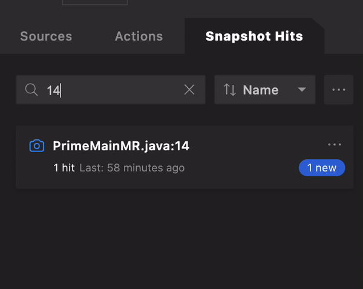

# Quick tour of the VSCode Lightrun plugin

<iframe width="560" height="315" src="https://www.youtube.com/embed/vJsz0jaW-VE" title="YouTube video player" frameborder="0" allow="accelerometer; autoplay; clipboard-write; encrypted-media; gyroscope; picture-in-picture" allowfullscreen></iframe>

The majority of the work you do with Lightrun, such as troubleshooting, debugging, and performance testing, is performed directly from your integrated development environment (IDE) or the [Lightrun CLI](/cli/cli_reference/).

Using the Lightrun plugin, provided for a variety of popular IDEs (such as VSCode, IntelliJ, and PyCharm), you can insert Lightrun actions (Logs, Metrics, and Snapshots) anywhere within the source code of your running applications. Also, from within the Lightrun plugin for your IDE, you can view, in real time, the output of Lightrun actions.

And, thanks to Lightrun's comprehensive range of integrations with third-party logging tools, from the plugin, you also can route output from Lightrun Logs and Metrics to your usual logging framework (such as [New Relic](/integrations/new-relic/) and [DataDog](/integrations/datadog-events/)).

## Scope of the quick tour

This quick tour article provides an overview of the main features and functionalities of the Lightrun Plugin for Visual Studio Code (VSCode). For detailed information on procedures for running Lightrun actions and managing configurations within VSCode, see:

- [Lightrun Dynamic Logs in VSCode](vscode-plugin-dynamic-logs.md){:target="_blank"}
- [Lightrun Dynamic Snapshots in VSCode](vscode-plugin-snapshots.md){:target="_blank"}
- [Lightrun Metrics in VSCode](vscode-plugin-metrics.md){:target="_blank"}

!!! prerequisites

    To follow this quick tour on your workstation, if not previously done: 
    
    - [Install the Lightrun plugin](vscode-install-plugin.md){:target="_blank"} 
    
    - [Authenticate](vscode-plugin-authentication.md){:target="_blank"} it
    
    - Attach at least one agent to your application
    
    - Open the source code folder for your running the application in the IDE

## The Lightrun sidebar layout

Upon clicking, in the VSCode activity bar, the Lightrun plugin icon , the Lightrun sidebar opens. Follow the on-screen instructions to [authenticate](vscode-plugin-authentication.md){:target="_blank"} the plugin.

After authenticating your Lightrun plugin, your VSCode IDE should appear similar to the following image.

## Plugin Tabs

There are three tabs in the Lightrun sidebar

- [Sources](#sources)
- [Actions](#actions)
- [Snapshot Hits](#snapshots)

Selecting any of the three tabs exposes additional menus and options, respectively for managing Agents and Tags, Lightrun actions, and Snapshot hits.

### Sources tab {#sources}

The Sources view tab exposes additional menus and options for managing your Lightrun agents, tags, and custom sources directly from your VSCode IDE.

There are two subtabs in the Sources tab.

- [The Agents subtab](#agents-subtab)
- [The Tags subtab](#tags-subtab)

#### Agents subtab {#agents-subtab}

The Agents subtab displays a list of live agents running alongside your applications. The Agents subtab appears similar to the following image:

Click the expand icon  on an agent to display the actions assigned to the agent.

Click the add icon  on an agent to add an action to the agent.

Click the menu icon  to display the **AGENT OPTIONS** menu.

Select **Pin** to pin the agent to the top of the Agents subtab or select **Details** to view more information about the agent.

The following table summarizes the information displayed in the **Agent details** window.

| Field         | Description                                                  |
| ------------- | ------------------------------------------------------------ |
| Name          | The agent's display name or host name if not specified                   |
| Host          | The name of the machine where the agent is running          |
| Environment   | The runtime environment of the application with which the agent is running|
| ID            | A unique identifier, automatically generated for the agent|
| PID           | The process ID (on the machine where the agent is running)   |
| Start Time    | The time at which the agent started running                  |
| API Version   | The version number of the server the agent is connected to              |
| Agent Version | The version number of the agent                            |
| Log Routing   | The configured [routing](#routing) method                   |
| Tags          | Next to **Agent details**, the names of tags that have been applied to the agent. If there are more than one tag, additional tags are displayed by clicking the  icon.

#### Tags subtab {#tags-subtab}

The Tags subtab lists all available tags with their associated agents and actions. The Tags subtab appears similar to the following image.

Click the expand icon  on a tag to reveal the agents and actions associated with that tag. 

Click the add icon  on a tag to add an action to the tag.

Click the menu icon  to display the **TAGS OPTIONS** menu.

Select **Pin** to pin the tab to the top of the Tags subtab or select **Delete** to delete the tag.

#### Sources dynamic search filter {#sources-search}

From the sources dynamic search field, you can search for Logs, Snapshots, and Metrics attached to specific agents or tags. As you begin typing, the list of relevant agents updates dynamically.

!!! tip
    Sources dynamic search is particularly useful for finding specific dynamic Logs, when working with multiple agents and tags.

### Actions tab {#actions}

The Actions tab lists all Lightrun actions (Logs, Metrics, and Snapshots) currently attached to your code. This includes active actions, disabled actions, expired actions, and actions with errors.

Click the menu icon  to access the **ACTION OPTIONS** menu.

- Click **Edit** to edit an action.
- Click **Go to** to navigate the VSCode code editor to the action file and code line. 
- Click **info** to view more information about the action.
- Click **Duplicate** to create another copy of the action.
- Click **Delete** to delete the action.

#### Actions dynamic search filter {#action-search}

The Actions dynamic search filter allows you to search for Lightrun actions using their names, agent names, filename, or code line. You can also sort the action tab with the Filename and Creation time options, or filter with the **All**, **Active**, **Expired**, and **Error** statuses. 

As you start typing, the search filter will update the action list dynamically.

### Snapshot Hits tab {#snapshots}

The **Snapshot hits** tab allows you to view and manage the snapshot hits captured in your system.

Use the dynamic search filter to filter snapshots base on their names, agent names, filename, or code line. You can also sort the snapshot hit tab with the **Name**, **Start time**, and **Recently hit** options, or load snapshot hits from an external file.

Click on a snapshot hit to view more information about the hit.

The snapshot hit data is divided into three sections.

| **Sections** | **Description** |
|---------------|----------------|
| **Snapshot hit details** | View more information about the snapshot. |
| **Snapshot hit variables** | View snapshot stacktrace variables. |
| **Snapshot hit call stack** | View snapshot stacktrace call stack (frames). |

- Click **Share** button to share the snapshot's data.
  
- Click on a call stack to navigate to the hit's source code and line

## Lightrun Console

The Lightrun Console lets you view and interact with data from dynamic logs and metrics directly from within your VSCode IDE. 

!!! note
    Data from dynamic logs and metrics only appear in the Lightrun Console when you set their target configuration to Plugin. 

The Lightrun Console appears similar to the following image.

- Enter an agent's name into the console’s search bar to display only data from logs and metrics associated with the agent alone.
- Click **Clear logs** to clear the entire console, and use the **My Logs only** toggle button to configure if you want to view actions created by you alone or actions created by other members of your team in the Lightrun Console.
- Right-click on a log, and click **Go to** to navigate to the log's source code and line.

## Additional features

Clicking the **More Options** icon  at the top of the plugin, opens the **PLUGIN OPTIONS** menu.  

{: style="width:50%"}

From here you can:

- Open, within VSCode, the Lightrun plugin extension settings window.
- Open the Lightrun documentation web page
- Open the Lightrun user feedback web page
- Refresh the user interface
- Navigate to Lightrun management portal
- Sign out from the current user
