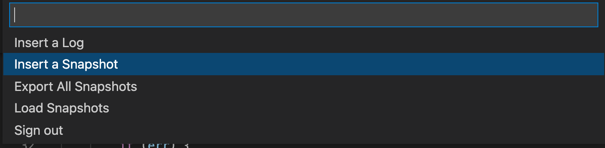

# Snapshots in the VSCode plugin

## Introduction

A snapshot is a virtual breakpoint that doesn't block your code from running. Unlike traditional breakpoint, snapshots collect the stack trace and variables without interrupting the application at all.

Once you've added a snapshot, you can view the output [directly from the IDE](#view).

--8<-- "ux-reference/vscode-plugin-prereq.md"

## Adding Snapshots

To add snapshots, you must open the **Insert a Snapshot** and enter values for snapshot parameters.

### Opening the **Insert a Snapshot** form

Select either of the following methods:

A. Through either the **Agents** or **Tags** tab  
B. From a code line in the VSCode editor

**A. Agents or Tags method:**

1. From either the **Agents** or **Tags** tab, select an agent or tag and click the **Add Action** icon .  
   The **ACTIONS** and **METRICS** menu opens.  
     
2. Under **ACTIONS**, select **Snapshot** to open the **Insert a Snapshot** form.
   

**B. Code line method:**

1. Go to the line in your application source code where you want to insert the snapshot.
2. Right-click to open the VSCode context menu.  
   {: style="width:75%"}
3. From the VSCode context menu, click **Lightrun...**.  
   The VSCode Command Palette opens with a list of Lightrun plugin options.  
    
4. From the Command Palette, select **Insert a Snapshot**.  
   The **Insert a Snapshot** form opens.  
   

### Entering Snapshot parameters

1. In the **Insert a Snapshot** form, complete the fields, as follows:

   | Fields | Description |
   |--------|-------------|
   |**SOURCE**| From the available options in the dropdown list, bind the action to a specific agent, tag, or custom source.  *Click the  icon to create a new custom source.* |
   |**FILENAME & LINE**| The source code file into which you're inserting the action. The default path is to the source code file from which you're currently working. |
   |**CONDITION**| The condition of an `if` statement, used to limit the execution of the action.  For example, The condition `myVar % 7 == 0` limits the action (log, snapshot, metric) output so that it only prints for variables that are divisible by 7.|
   | **HIT LIMIT** | The maximum number of times the snapshot should be taken during the lifetime of the action; default = 1. |
   |**LIFETIME** | The time after which the action ceases to track code behavior and is automatically disabled; default = 1 hour.|
   |**TARGET**| Select your preferred action output taget. You can pick either:  - **Stdout** - Logs are routed only to your application's standard output. - **Plugin** -  Logs appear in the Lightrun Console, the Lightrun Management Portal, and configured integrations. or both options at once.|
   | **WATCH EXPRESSIONS** | Variables or method results to be displayed in the snapshot stack trace. Click **+** to add additional watch expressions. An expression that you define to be monitored as part of the snapshot. You can evaluate complex expressions, such as methods. |

2. Click **Create** to add the snapshot.  

    Upon snapshot creation:  
  
   - In the editor area, the  icon appears next to the selected code line.  
   - In the Lightrun plugin, either the **Tags** or **Agents** tab opens and the requested agent or tag is expanded, with the Snapshot action appearing below it.

## Viewing Snapshot data

After you add a snapshot to your code, and a snapshot hit is captured:

- A notification that a snapshot was captured appears in the on the bottom right edge of the VSCode screen.

- The snapshot variables and stack trace appear under the **Snapshots** tab in the Lightrun plugin.

**To view Snapshot variables and stack traces:**

1. To open a snapshot, use either option A or B:

   **Option A** - From either the **Agents**, **Tags**, and from the list, select the relevant snapshot.  
   **Option B** - Open the **Snapshots** tab and, from the list, select the relevant snapshot.

   The snapshot view window opens in the **Snapshots** tab.  
   {: style="width:30%"}

2. To expand the snapshot data view, click the (**>**) icons, next to **Variables** and **Call Stack**.
3. To view snapshot hits within a series, click the &#8592 and &#8594 arrows to cycle through the series or enter a snapshot hit number in the **Go to hit** box and click **Go**.
4. To view details of a specific frame within a snapshot hit, in the **Call Stack** pane, click on the relevant stack trace variable or method. In the example below, the **add** method is selected, and the relevant variable values displayed.  
   

!!! info

    Viewing snapshots from the Lightrun Management Portal is described [here](../snapshots.md){:target="_blank"}.

## Viewing and editing a Snapshot configuration

After you have created a snapshot, you can view and edit its configuration.

1. In the Lightrun plugin, depending on the target, select either the **Agents** or **Tags** tab.
2. Next to the Snapshot entry, click the **Snapshot Options** menu icon (**...**) and select **Details**.  
   The **Snapshot details** window opens.  
   {: style="width:30%"}
3. To edit the configuration, click the edit icon .  
   The **Edit a Snapshot** form opens.
4. In the respective fields, enter new values for line number, condition, hit limit, and so on.

## Duplicating a snapshot action

1. Hover your cursor over the relevant snapshot in the Lightrun sidebar.
2. Right-click and select **Duplicate**.
   
   

3. Go to the selected destination and right-click and select **Duplicate**.

## Exporting Snapshot data

Once a snapshot hit has been captured, it is possible to export the snapshot data for analysis in another IDE. Lightrun allows you to export the data of all available snapshots in your system, or the data of a single snapshot at once. 

###### To export your entire Snapshot data

1. Select the **Snapshot** tab in your VSCode Lightrun plugin.
2. Click the **MORE OPTIONS** menu icon (**...**) next to the search field and the **SORT BY** dropdown.
   
3. Click **Export all** in the menu that appear. Pick your preferred storage location and click **select** to export the snapshots. 
4. A `.lrsnapshot` file will be saved in the selected location.

###### To export a single Snapshot data

1. Select the **Snapshot** tab in your VSCode Lightrun plugin.
2. Next to the Snapshot entry, click the **Snapshot Options** menu icon (**...**) and select **Export**. Pick your preferred storage location and click **select** to export the snapshot data. 
3. A `.lrsnapshot` file will be saved in the selected location.

###### To load a Snapshot file in your VSCode IDE

1. Select the **Snapshot** tab in your VSCode Lightrun plugin.
2. Click the **MORE OPTIONS** menu icon (**...**) next to the search field and the **SORT BY** dropdown.
   
3. Click **Load Snapshots**. Navigate to the snapshot file location and select the `.lrsnapshot` file to load the snapshot details in your IDE.