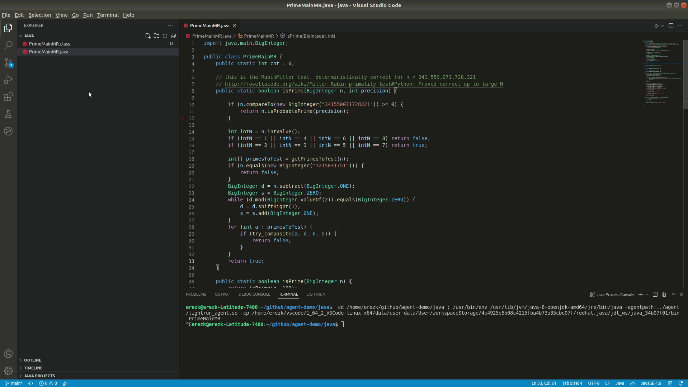
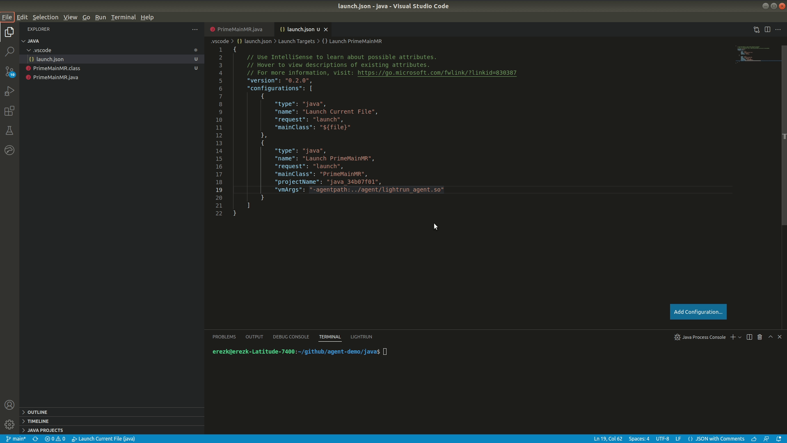
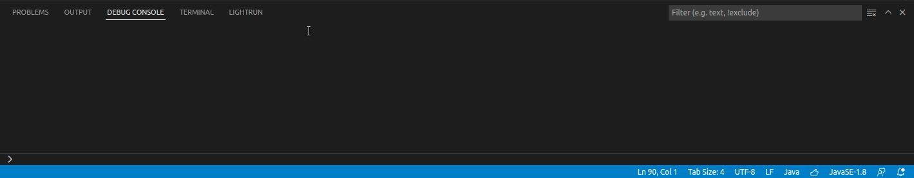

# Setting up a Java application to launch with Lightrun

## Introduction
When you'd like to debug your application using Lightrun, running the application with Lightrun's agent directly from VSCode becomes very handy and useful.  
It is no longer needed to leave VSCode to an external terminal to run the agent and the application.  There is also no need to run Java explicitly in that terminal.  
This can be achieved by a simple, straight-forward configration (JSON based) which holds the required attributes and values for launching your application.  
Just add a single line of conifugration as described below and you're good to go.  

!!! reqs "Before you begin"
    To be able to launch your application with Lightrun directly from VSCode, make sure:

    - [Extension Pack for Java](https://marketplace.visualstudio.com/items?itemName=vscjava.vscode-java-pack) is installed in VSCode
    - Lightrun's extension is [installed](vscode-install-plugin.md) and you've [authenticated](vscode-plugin-authentication.md)
    - Your Java application is compiled with the `-g` flag
    - Lightrun's Java agent is [installed](../jvm/agent.md) to a known location

## Configuring VSCode
### Adding a Configuration
1. Set focus on your code
1. From the **Run** menu select **Add Configuration**  
1. Go to the configuration section where the application's class appear as `mainClass`
1. Add the agent's path to the vmArgs attribute.  
   Replace the path below with the actual path to the agent.   
   Linux:
    ```json
    "vmArgs": "-agentpath:/path/to/agent/lightrun_agent.so"
    ```
   Windows:
    ```json
    "vmArgs": "-agentpath:C:\\path\\to\\agent\\lightrun_agent.dll"
    ```  
1. Save the configuration `CTRL+S`

!!! note

    If you already have a run configuration, simply select **Open Configurations** from the **Run** menu 

<figure markdown>
  { width="1000" }
  <figcaption>Creating a run configuration</figcaption>
</figure>

### A simple launch configuration

``` json
{
    "version": "0.2.0",
    "configurations": [
        {
            "type": "java",
            "name": "Launch PrimeMainMR",
            "request": "launch",
            "mainClass": "PrimeMainMR",
            "projectName": "java_34b07f01",
            "vmArgs": "-agentpath:../agent/lightrun_agent.so"
        }
    ]
}

```

!!! info

    Additional **vmArgs** can be added, such as **-Xmx1G** to increase the heap size to 1GB,
    see [Java debugging options](https://code.visualstudio.com/docs/java/java-debugging#_configuration-options)

!!! tip

    You can easily add attributes by using VSCode's Intellisense `CTRL+SPACE`

### Adding extra class paths

!!! info "This step is not mandatory"
In some cases you might need to add additional classes to the agent's path, as described [here](/troubleshooting/java-troubleshooting/#source-file-not-found){:target="_blank"}.
``` json
{
    "version": "0.2.0",
    "configurations": [
        {
            "type": "java",
            "name": "Launch PrimeMainMR",
            "request": "launch",
            "mainClass": "PrimeMainMR",
            "projectName": "java_34b07f01"
            "vmArgs": "-agentpath:/path/to/agent/lightrun_agent.so=--lightrun_extra_class_path=/path/to/extra/classes"
        }
    ]
}
```

## Running the application

Using Lightrun to debug your application does not require an actual debugger, and does not require setting breakpoints to debug.  
Instead, you run your application using Lightrun's agent and insert snapshots, logs and metrics as you like.  

1. Set focus back on your code
1. Run the application from the debugger extension by selecting **"Run Java"**  
   Do **not** select "Debug Java", only "Run Java".  
   Other options to run the application are hitting `CTRL+F5` or selecting **Run Without Debugging** from the **Run** menu.  

!!! success "Good job!"

    The application will run now by Lightrun's agent as can be seen in the **TERMINAL**.  
    You can now select Lightrun's extension to see the running agent on the sidebar.

<figure markdown>
  { width="1000" }
  <figcaption>Running the application with the agent</figcaption>
</figure>

## Debugging the application with Lightrun

Now that you've successfully launched you application using Lightrun's agent, it's debugging time...  
See how you can use [snapshots](vscode-plugin-snapshots.md), [logs](vscode-plugin-dynamic-logs.md), and [metrics](vscode-plugin-metrics.md) to gain dynamic observability into your application.

## Stopping the application

In case the application needs to be stopped (e.g. debugging has ended), just go to the terminal window and hit `CTRL+C`
<figure markdown>
  { width="1000" }
  <figcaption>Stopping the application and agent</figcaption>
</figure>

