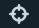

|      | Icon                                                         | Function                                                  |
| ---- | ------------------------------------------------------------ | ------------------------------------------------------------ |
| 1    |            | Opens the information dialog box for the agent, tag, or action.    |
| 2    |                   | Delete any agent or tag actions. Only agent-activated actions can be deleted from the Agents list and tag-activated actions from the Tags list. |
| 3    |                 | Jump to the source file and line number in the code that is associated with the action. |
| 4    |                   | Toggle to disable or enable an action. Only agent-activated actions can be toggled from the Agents list and tag-activated actions from the Tags list. |
| 5    |  | Displays the current state of the action. - One checks indicates the action was submitted to the server. - Two checks indicate that it was received by the agent. - Highlighted checks indicate that the agent accepted the action. From the Agents list, the tag icon indicates the action was activated with tags and not agents, and its status can be viewed from the Tags list. |
| 6    |          | Indicates the the level that was configured for the log (on log rows only): Info, Debug, Warn, Error. |