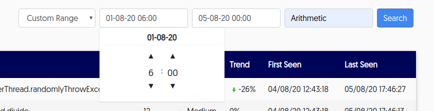

The **Exceptions** table lists general details and statistics for each of the exceptions that are thrown by all of the applications you're watching.

The **Exceptions** table appears similar to the following:

From this area, you can: 

- [search for exceptions](#search)

- [view exception details](#details)

## Search for specific exceptions {#search}

Go to the top right of the table area to access different search options, such as those in the following image: 

You can search using:

- free text
- by pre-configured specific time frames available from the **Time** dropdown list
- by a custom range of time that you set yourself

## View exception type details and exception stack traces {#details}

You can drill down to view:

- specific details for a specific exception type

- stack trace frame-by-frame for a specific exception instance 

###### To drill down for details

1. Click a specific type of exception from the table to view the list of exceptions of that type and related details.

2. From the module listing exceptions by type, click a specific exception to view its stack trace.

    You can also view snapshots of individual frames in the stack trace.

    

3. Click the row of a specific frame to view the variables related to the exception that was thrown.
