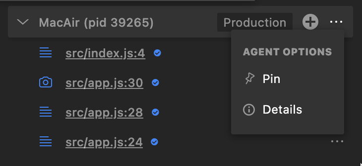
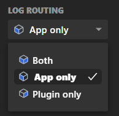

To view Lightrun Logs and Metrics data from VSCode, you must configure the routing accordingly.

There are three levels of routing for output from Lightrun dynamic logs and metrics:

- **Stdout** - Output appears only in the application's standard output.

- **Plugin** - Output appears in the Lightrun Management Portal, Lightrun Console, and integrations.

- **Both** - Output appears in the Lightrun Management Portal, Lightrun Console, integrations, and standard output.

**To configure routing:**

1. From the Lightrun sidebar, choose either of the following methods.
2. Under the **Agents** tab, for the relevant agent, click the  icon.  
   The **AGENT OPTIONS** menu opens.  
   {: style="width:50%"}
3. Choose either of the following two methods:

   **Method A:**  
   From the **Agent Options** menu, under **LOG ROUTING**, select an options from **Stdout**, **Plugin**, or **Both**.  

   **Method B:**  
   1. From the **Agent Options** menu, under **AGENT OPTIONS**, select **Details**.  
   The **Agent Details** window opens, with the **LOG ROUTING** options menu.

   {: style="width:30%"}  
   2. From **LOG ROUTING**, select an option from **Both**, **App only**, or **Plugin only**.

!!! note
    Dynamic Logs and Metrics are sent from the agent to the plugin via the Lightrun server. As this process is batched, output may appear with a slight delay.
